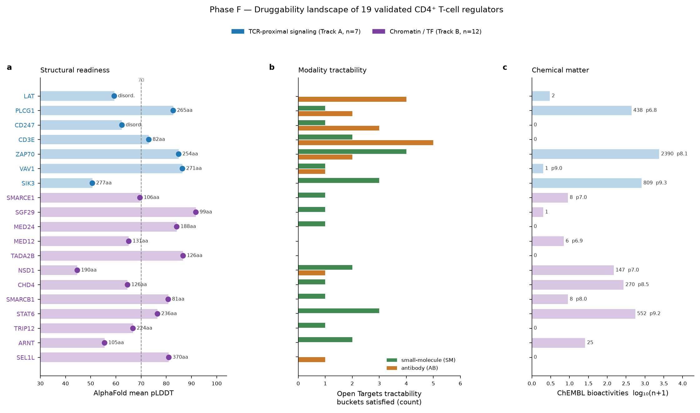
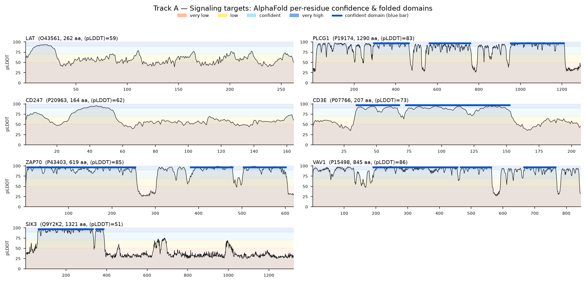
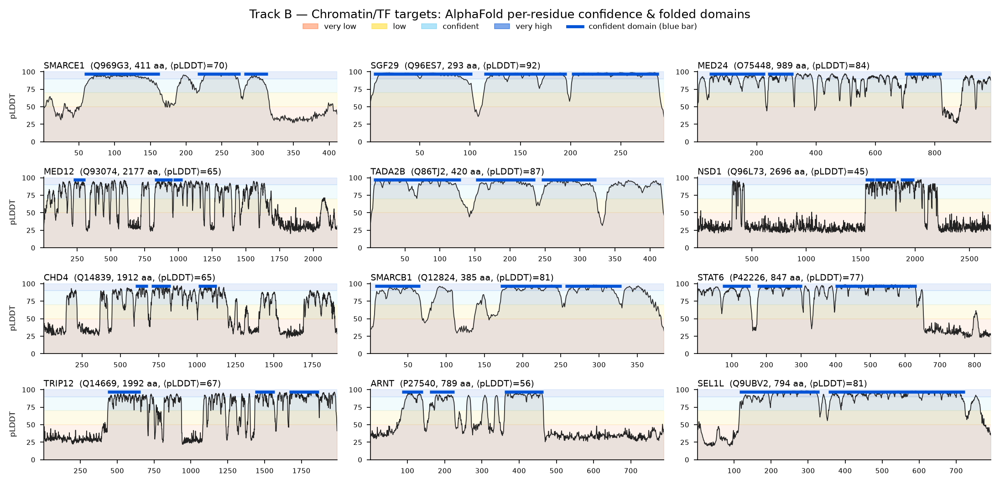
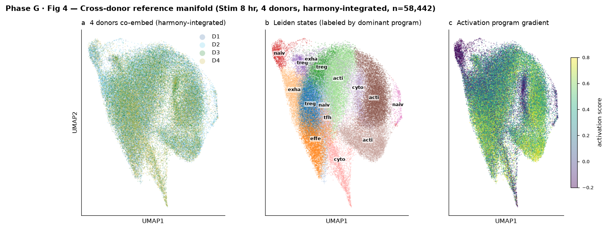

# CD4⁺ T-Cell Perturb-seq Drug-Target Discovery — Consolidated Report (Phases A–G)

**Project:** Discovery and translational prioritization of novel druggable regulators of CD4⁺ T-cell programs from a genome-scale CRISPRi Perturb-seq atlas.
**Dataset:** Zhu, Dann, Yan, Reyes Retana, Goto, Guitche, Petersen, Ota, Shy, Pritchard & Marson, *Genome-scale perturb-seq in primary human CD4⁺ T cells maps context-specific regulators of T cell programs and human immune traits*, bioRxiv **2025.12.23.696273** (CZI Virtual Cells Platform; MIT license, unpublished).
**Compute:** `ssh:clust1-rocm-4`, conda env `perturb-seq`; all data on Lustre project directory.

---

## 0. Executive summary

Reading a CRISPRi knockdown as a genetic model of drug-induced loss of function, this project mined the perturbation→transcriptome map **backwards** — from therapeutically desirable T-cell programs to the upstream regulators that control them — and carried the resulting candidates from genome-scale nomination through single-cell validation to translational dossiers.

- **Phase A (foundation).** Audited the precomputed DESeq2 layer (33,983 perturbation×context contrasts × 10,282 genes), defined a reproducible, on-target, off-target-clean **high-confidence set of 12,576 perturbations / 5,728 genes**, and confirmed known drug-target biology reproduces (**13/16 positive controls** pass expected direction).
- **Phase B–C (discovery + integration).** Four orthogonal functional directions + two external evidence layers (human genetics, druggability) converged on **301 candidate genes** (≥2 directions; 61 at ≥3; LAT/PLCG1/SENP5 at all 4). **127/301** carry immune-disease GWAS support; **178** are novel-druggable. Delivered as a ranked `TARGET_SCORECARD.csv` + `TARGET_REPORT.md`.
- **Phase D (single-cell validation, 1 donor).** All **7 flagship targets** validated at single-cell resolution on donor D4 (knockdown, pseudobulk concordance, and stimulation-dependence all confirmed).
- **Phase E (cross-donor + novel axis).** All **7 flagship targets reproduce across 4 donors**, and — the central novelty result — all **12 drug-naive chromatin/transcriptional-axis targets validate** at single-cell resolution. The novel axis is **mechanistically distinct** from acute TCR signaling (89% cluster recovery; 2.4× smaller state-space displacement).
- **Phase F (translational dossiers).** Structure + chemical matter + tractability + clinical + genetics for all **19 validated targets**. **18/19 are clinically unprecedented** (only CD3E is drugged). Top-ranked opportunity: **STAT6**; other standouts SIK3 (novel kinase) and the drug-naive SAGA/Mediator readers MED24/SGF29/TADA2B.
- **Phase G (deep single-cell analysis).** Nine analyses across three tiers, on the 19 nominated targets with 4 donors pooled, answering questions **only single-cell resolution can answer**. Key results: TCR-proximal knockdown **holds cells early on the activation trajectory** and has a larger effect in low-activation cells (activation-gated, MWU p=4e-4), whereas the chromatin/TF axis is **orthogonal to trajectory position** — the two axes are mechanistically separable at single-cell resolution; **35 cross-donor-consistent differential-abundance events** show the KD phenotypes reproduce; **MED12/MED24 knockdown *expands* the Treg-like compartment** (rare-state safety signal); **17/17 testable targets are dual-guide concordant single-cell** (anti-off-target confirmation). Gives the pseudobulk nominations an independent single-cell validation pseudobulk cannot provide.

**One-line conclusion.** The pipeline recovers established immune drug targets *de novo* (validating the logic) and nominates a genetically-supported, single-cell-validated, structurally-tractable set of **novel** CD4⁺ T-cell regulators — headed by STAT6 and a drug-naive chromatin/transcriptional axis — as fresh therapeutic entry points for autoimmune/allergic and immuno-oncology indications.

---

## 1. Data analyzed

### 1.1 The atlas
- **Assay:** genome-scale CRISPR interference (CRISPRi), probe-based Perturb-seq (10x Flex), 2 guides/gene.
- **Scale:** ~22 million primary human CD4⁺ T cells; **4 donors** (D1–D4) × **3 contexts** (**Rest, Stim8hr, Stim48hr** = TCR/CD28 re-stimulation timecourse).

### 1.2 Layers used per phase
| Layer / object | Size | Used in | Role |
|---|---|---|---|
| `GWCD4i.DE_stats.h5ad` | 16.8 GB | A, B, C | **Primary object** — 33,983 (perturbation×condition) × 10,282 genes; DESeq2; `.layers` = `log_fc`, `zscore`, `p_value`, `adj_p_value`, `baseMean`, `lfcSE`; `.obs` = on-target effect, trans-effect counts, reproducibility + off-target flags. |
| `GWCD4i.pseudobulk_merged.h5ad` | 44.6 GB | A | Per (guide×donor×condition) pseudobulk, 18,129 genes, QC/eligibility flags. |
| `GWCD4i.DE_stats.by_guide.h5mu` / `.by_donors.h5mu` | 29.4 / 16.9 GB | A (reproducibility) | Per-guide and per-donor-pair DE (two-guide + cross-donor agreement). |
| `D{1..4}_{Rest,Stim8hr,Stim48hr}.assigned_guide.h5ad` | 111–172 GB each (12 shards, ~1.8–2.3 TB) | D, E | Cell-level raw counts (18,130 genes); slab-streamed selectively. |
| Connectors (AlphaFold, RCSB PDB, ChEMBL, Open Targets, GWAS Catalog) | — | B(D5/D6), F | External genetics, tractability, structure, chemical matter, clinical status. |

**The workhorse signal is the `zscore` layer** (= log2FC / lfcSE) of the precomputed genome-wide DESeq2 object — avoids re-running DE on 22 M cells. Cell-level shards were used only for single-cell validation (D, E).

---

## 2. Methods and parameter settings

### 2.1 Global conventions
- **Candidate universe (Phases B–F):** only Phase A **high-confidence** perturbations (reproducible across guides & donors, on-target-significant, off-target-clean) were eligible — 12,576 profiles / 5,728 genes.
- **Direction is always recorded:** CRISPRi models loss-of-function only, so every therapeutic hypothesis states whether the target should be **inhibited** or **activated**.
- **Significant DE edge:** adj_P < 0.10 AND |z| > 2.0 (1,302,641 edges genome-wide) — used for network out-degree and module detection.

### 2.2 Phase A — foundation
- **High-confidence definition:** on-target significant AND on-target effect < 0 AND (two-guide agreement `r>0, p<0.05` OR cross-donor `donor_correlation_hits_mean > 0.3`) AND flag-clean (not distal_offtarget / neighboring_gene_KD / low_target_gex).
- **Positive-control benchmark:** 16 known T-cell regulators tested for self-knockdown + expected downstream direction.

### 2.3 Phase B — six discovery directions
- **D1 cytokine regulators:** signed effect on IL2, IFNG, IL4, IL13, IL17A, IL21, TNF, IL10, IL2RA, CTLA4; strong bar = ≥2 effector cytokines moved.
- **D2 polarization:** curated Th1/Th2/Th17/Treg/Tfh program gene-sets scored on the `zscore` layer; strong bar = |z| ≥ 3 shift.
- **D3 context-specific:** contrast Rest → Stim8hr → Stim48hr; strong bar = activation-family with specificity ≥ 0.8 AND stim reach ≥ 50; each gene classified constitutive / activation-induced / rest-specific.
- **D4 network hubs:** perturbation→gene bipartite network from significant edges; out-degree (`n_downstream`); modules via scipy hierarchical clustering on Jaccard distance of downstream signatures, cut t = 0.70; strong bar = top-200 hubs.
- **D5 human genetics:** GWAS Catalog associations for each gene, immune-trait keyword filter (RA, IBD/Crohn's/UC, MS, T1D, SLE, asthma, allergy, psoriasis).
- **D6 druggability:** Open Targets tractability + known drugs; ChEMBL target class / mechanism. `novel-druggable` = no approved/clinical/known drug AND (SM- OR AB-tractable).

### 2.4 Phase C — composite score
Six sub-scores normalized 0–1: effect (0.15), reproducibility (0.15), immune-program biology (0.20), context-specificity (0.10), network hub (0.10), disease genetics (0.15), druggability (0.15); × (1 + 0.10·(n_directions − 1)) convergence bonus; each gene scored at its strongest condition.

### 2.5 Phase D / E — single-cell validation
- **Subset construction:** per shard, **all KD cells** for the target set ∪ **40,000 NTC** ∪ **40,000 background** cells, filtered `low_quality == False`; `normalize_total(1e4)` + `log1p` (raw counts kept in a `counts` layer). Gathered by slab-streaming CSR from the 111–172 GB shards (SLAB = 500 M nnz).
- **On-target KD%:** relative reduction of target's mean linear expression, KD vs NTC; **confirmed if > 15%** (one-sided Mann–Whitney p reported).
- **Pseudobulk concordance:** Pearson *r* between single-cell KD-vs-NTC log-fold-change and bulk DE_stats signal over each target's **top-150 signature genes** (matched on ENSG); **concordant if r > 0.30**.
- **Powered donor:** ≥ 15 KD cells for that target in that subset; under-powered target×donor cells are **excluded from pass/fail, never pooled**.
- **Stim-dependence:** ratio of mean |Δ| over the Stim8hr signature between conditions; **stim-dependent if ratio > 1.5**.
- **State manifold:** 2,000 HVG → scale (max 10) → PCA(50, arpack) → neighbors(15, 40 PC) → Leiden(res 1.0) → UMAP(min_dist 0.3), built on **control cells only** (NTC + background); all cells projected into the control PCA basis and assigned to nearest cluster centroid. Six curated programs scored per cell: naive/memory, effector, activation, Treg, cytokine, exhaustion.

### 2.6 Phase F — translational assessment
- **Structure:** AlphaFold DB canonical model (GDM monomer, v6) per UniProt accession; per-residue pLDDT from B-factor column; confident domain = contiguous run ≥ 30 residues at pLDDT ≥ 70. Experimental coverage = RCSB PDB match count.
- **Chemical matter:** ChEMBL bioactivity count, max pChEMBL (over a 200-activity sample — a representative ceiling), sub-µM compound count, per single-protein human target.
- **Tractability / clinical:** Open Targets small-molecule (SM), antibody (AB), protein-degradation (PR) buckets; `drugAndClinicalCandidates` known-drug counts.
- **Readiness score:** structure (pLDDT ≥ 80 → +1.5; longest domain ≥ 150 aa → +1.0; ≥ 5 PDB → +0.5) + chemical matter (≥ 2 SM buckets → +1.0; ≥ 100 bioactivities → +1.0; max pChEMBL ≥ 8 → +1.0) + genetics (min(GWAS/20, 1) × 2.0) − essentiality risk (KD < 60% → −1.5). A prioritization aid, not a cutoff.

---

## 3. Phase A — Foundation (QC, reproducibility, positive controls)

**A1 — schema & QC.** 33,983 (perturbation×context) rows, 11,526 unique targets, 10,282 measured genes, balanced across contexts (Rest 11,287 / Stim8hr 11,415 / Stim48hr 11,281). Knockdown efficiency: 62.4% of rows on-target significant; median on-target DE z-score −6.30 (median on-target log2FC −2.48; −2.77 among significant knockdowns ≈ 6.8-fold). Exclusion-flag rates: low_target_gex 23.0%, neighboring_gene_KD 7.7%, distal_offtarget_flag 1.3%.

**A2 — reproducibility landscape.** Nested funnel: 33,983 → on-target 21,221 → + reproducible (guide|donor) 14,509 → + flag-clean = **high-confidence 12,576** (5,728 unique targets; per context Rest 3,714 / Stim8hr 4,492 / Stim48hr 4,370). Top trans-effect hubs are dominated by canonical TCR-proximal signaling (CD3E, LAT, ZAP70, PLCG1, VAV1, CD247) + SAGA/Mediator subunits (TADA2B, SGF29, TAF6L, MED12, CCNC) — a sanity check that the set surfaces real regulators. SENP5 flagged as a large-magnitude non-canonical outlier for inspection.

**A3 — positive-control benchmark. 13/16 known regulators pass expected direction** (TBX21→IFNG/CXCR3, GATA3→IL4/IL5/IL13, STAT5A/B→IL2RA, LCK/ZAP70/CD28/PPP3CA→IL2/IFNG, BATF, IL2RA-self). Three expected caveats: FOXP3 and BCL6 readouts are weak in this bulk stimulated setting; NFATC2 shows a paradoxical (non-significant) self-effect, consistent with the paper flagging non-replicating NFAT-family trans-effects. **Coverage note:** JAK1/JAK3 are not in the perturbation set (kinases were ineligible), so the IL-2/JAK-STAT axis was benchmarked via STAT5A/B + IL2RA proxies.

---

## 4. Phase B — Six discovery directions

From the 12,576-perturbation high-confidence universe, six complementary lenses on the DE matrix. A target surfacing in several directions is stronger.

- **D1 — cytokine master regulators:** 3,900 gene×condition×cytokine effects. Knockdowns suppressing pathogenic cytokines → anti-inflammatory candidates; boosting effector output → immuno-oncology candidates.
- **D2 — polarization:** 1,109 lineage-shifting knockdowns (Th1/Th2/Th17/Treg/Tfh).
- **D3 — context-specific:** 5,728 genes classified by activation-context; activation-induced targets are attractive (a drug would act on activated, disease-driving T cells while sparing the resting repertoire).
- **D4 — network hubs:** 12,576 hubs with out-degree; downstream-signature clustering recovers known protein complexes (TCR-proximal, SAGA/Mediator, mitochondrial) purely from co-regulation.
- **D5 — human genetics:** 127/301 priority candidates carry immune-disease GWAS support.
- **D6 — druggability:** 178 novel-druggable (tractable but drug-naive); 27 already drug targets recovered *de novo*.

---

## 5. Phase C — Integration & target scorecard

The six directions were integrated into a composite score (Methods 2.4). **301 convergent candidate genes** (≥2 directions; 61 at ≥3; 3 at all 4 — LAT, PLCG1, SENP5). Therapeutic direction split: 185 suppress-inflammation, 64 boost-immunity, 49 mixed. **27 candidates are already drug targets** (CD3E, ITK, MALT1, CD28, IL4R, IL2RB, STAT3, PTPRC…) — recovered *de novo* by the CRISPRi logic.

**Top-10 integrated targets** (full 301 × 35-column table in `TARGET_SCORECARD.csv`):

| Rank | Gene | Best cond. | Score | #Dir | Direction | Novelty | Immune GWAS |
|---|---|---|---|---|---|---|---|
| 1 | LAT | Stim8hr | 0.925 | 4 | suppress | novel-druggable | – |
| 2 | SMARCE1 | Stim8hr | 0.909 | 3 | suppress | novel-druggable | 37 |
| 3 | PLCG1 | Stim8hr | 0.908 | 4 | suppress | novel-druggable | – |
| 4 | CD247 | Stim8hr | 0.905 | 3 | suppress | novel-druggable | 46 |
| 5 | STAT6 | Stim48hr | 0.885 | 3 | boost | novel-druggable | 55 |
| 6 | CD3E | Stim8hr | 0.881 | 3 | suppress | known-drug-target | 3 |
| 7 | ZAP70 | Stim8hr | 0.836 | 3 | suppress | novel-druggable | 1 |
| 8 | IL4R | Stim48hr | 0.832 | 3 | boost | known-drug-target | 48 |
| 9 | VAV1 | Stim8hr | 0.830 | 2 | suppress | novel-druggable | – |
| 10 | TMX1 | Stim8hr | 0.800 | 3 | suppress | novel-druggable | 1 |

**Two mechanistic axes emerge:** (i) the **TCR-proximal signalosome** (LAT, PLCG1, CD247, CD3E, ZAP70, VAV1, ITK) — validated pathway, several drug-naive entry points; (ii) a **chromatin/transcriptional co-activator axis** (SAGA/Mediator: SGF29, MED12/24, TADA2B, TAF6L; remodelers: SMARCE1, SMARCB1, NSD1, CHD4) — structurally tractable, largely undrugged, several with strong autoimmune GWAS signal. The highest-confidence *novel* candidates combine ≥3-direction convergence + novel-druggability + immune GWAS: **SMARCE1, CD247, STAT6, ZAP70, TRIP12, NSD1, ARNT, SEL1L**.

---

## 6. Phase D — Single-cell validation (donor D4)

Do the pseudobulk-nominated flagship targets survive at **single-cell resolution** in raw counts, and is their stimulation-dependence real per-cell? Validated on donor D4, Rest vs Stim8hr (2.69 M and 2.73 M cells; working subsets = all flagship-KD + 40k NTC + 40k background per condition). The seven flagship targets span both scorecard axes: TCR-proximal signaling (LAT #1, PLCG1 #3, CD247 #4, CD3E #6, ZAP70 #7, VAV1 #9) + a constitutive chromatin regulator (SMARCE1 #2) carried as an internal specificity control.

**All 7 validate.** On-target KD 76–94% (Mann–Whitney p<1e-8 for 6/7; SMARCE1 p=6.2e-4 at 12 cells); single-cell signatures concordant with pseudobulk (Pearson r 0.43–0.85); TCR-proximal targets **4.2–8.9× stronger in Stim8hr than Rest**; SMARCE1 **0.87×** (constitutive, the clean internal control).

| Target | n KD cells | On-target KD | Pseudobulk r | Stim/Rest | KD✓ | Concord✓ | StimDep✓ |
|---|---|---|---|---|---|---|---|
| LAT | 76 | 86% | 0.69 | 5.6× | ✓ | ✓ | ✓ |
| PLCG1 | 110 | 88% | 0.43 | 7.0× | ✓ | ✓ | ✓ |
| CD247 | 90 | 94% | 0.44 | 6.3× | ✓ | ✓ | ✓ |
| CD3E | 91 | 92% | 0.85 | 8.9× | ✓ | ✓ | ✓ |
| ZAP70 | 17 | 91% | 0.77 | 4.2× | ✓ | ✓ | ✓ |
| VAV1 | 106 | 83% | 0.65 | 4.9× | ✓ | ✓ | ✓ |
| SMARCE1 | 12 | 76% | 0.67 | 0.9× | ✓ | ✓ | ✗ (constitutive) |

---

## 7. Phase E — Cross-donor reproduction & novel-axis validation

Phase E extends Phase D two ways: **(E1)** reproduce the flagship 7 across **all four donors**, and **(E2/E3)** deliver the first single-cell validation of the **12-target drug-naive chromatin/transcriptional axis** — the program's central novelty claim. Five compact subsets (82,398–82,715 cells each; all 19 targets' KD cells + 40k NTC + 40k background) were slab-streamed from the 111–172 GB shards. **The D4_Stim8hr gather reproduces Phase D's KD-cell counts exactly** (LAT 76, PLCG1 110, …, SMARCE1 12) and KD%/concordance to ≤0.001 — same pipeline.

### 7.1 E1 — flagship reproduces across donors
**All 7 fully reproducible** — KD confirmed (>15%) AND concordant (r>0.30) in every powered donor.

| Target | Powered donors | KD% (mean, min) | Concordance r (mean, min, CV) | Verdict |
|---|---|---|---|---|
| LAT | 4/4 | 0.85, 0.74 | 0.67, 0.55, CV 0.12 | reproducible |
| PLCG1 | 4/4 | 0.88, 0.86 | 0.46, 0.41, CV 0.11 | reproducible |
| CD247 | 4/4 | 0.72, 0.38 | 0.51, 0.44, CV 0.16 | reproducible |
| CD3E | 4/4 | 0.96, 0.92 | 0.85, 0.84, CV 0.007 | reproducible |
| ZAP70 | 3/4 | 0.91, 0.90 | 0.78, 0.76, CV 0.033 | reproducible |
| VAV1 | 3/4 | 0.92, 0.83 | 0.66, 0.64, CV 0.040 | reproducible |
| SMARCE1 | 3/4 | 0.88, 0.77 | 0.74, 0.74, CV 0.007 | reproducible |

CD3E/ZAP70/SMARCE1 are exceptionally stable (concordance CV 0.007–0.033). Under-powered exclusions (<15 KD cells): ZAP70/D3 (2), VAV1/D3 (13), SMARCE1/D4 (12).

### 7.2 E2 — the novel axis validates single-cell
**All 12 novel-axis targets validate** — KD confirmed AND concordant in every powered donor. This is the first single-cell evidence for the chromatin/transcriptional axis.

| Group | Target | KD% mean | Concordance r | Powered | Verdict |
|---|---|---|---|---|---|
| SAGA/Mediator | SGF29 | 0.94 | 0.69 | 4/4 | validated |
| SAGA/Mediator | MED24 | 0.96 | **0.80** | 4/4 | validated |
| SAGA/Mediator | MED12 | 0.85 | **0.76** | 4/4 | validated |
| SAGA/Mediator | TADA2B | 0.92 | **0.74** | 4/4 | validated |
| Remodeler | NSD1 | 0.92 | 0.65 | 3/4 | validated |
| Remodeler | CHD4 | 0.52 | 0.38 | 4/4 | validated |
| Remodeler | SMARCB1 | 0.48 | 0.59 | 4/4 | validated |
| TF/kinase | STAT6 | 0.82 | 0.57 | 4/4 | validated |
| TF/kinase | TRIP12 | 0.84 | 0.70 | 4/4 | validated |
| TF/kinase | ARNT | 0.89 | 0.69 | 4/4 | validated |
| TF/kinase | SEL1L | 0.94 | 0.42 | 3/4 | validated |
| TF/kinase | SIK3 | 0.87 | 0.52 | 3/4 | validated |

**SAGA/Mediator concordance often exceeds the flagship** (MED24 0.80, MED12 0.76, TADA2B 0.74 vs PLCG1/CD247 0.46–0.51). **Remodelers are harder to knock down** (CHD4 0.52, SMARCB1 0.48 — expected for large essential complexes) but remain concordant. **Stim-dependence (D4):** flagship mean 8h/48h ratio 2.00 (early-peaking); novel axis mean 1.72, systematically smaller effect magnitudes — the expected broad, sustained, lower-amplitude behaviour of chromatin/transcriptional regulators.

### 7.3 E3 — the novel axis is mechanistically distinct
A 13-cluster Leiden manifold on 80k D4_Stim8hr control cells; all 19 targets projected in.

- **Program-Δ vectors cluster by axis at 89% (17/19).** Ward clustering into 2 clusters recovers the flagship/novel split. The two crossovers are biologically sensible and *strengthen* the interpretation: **SMARCE1** (scorecard-flagship) clusters with the novel axis — it is a SWI/SNF chromatin factor, not a signaling gene (its flat stim-dependence flagged the same); **SMARCB1** (novel remodeler) clusters with TCR-proximal — its Δ-profile is an effector/cytokine-loss activation-collapse.
- **TCR-proximal knockdown causes coordinated activation collapse:** activation −0.518, Treg −0.398, cytokine −0.456 (all MWU p=0.0001) with compensatory naive/memory +0.232; the chromatin/TF axis has near-zero activation/Treg shifts (5/6 programs differ significantly).
- **The novel axis redistributes far fewer cells:** perturbation magnitude ‖Δ‖ 0.958 (TCR) vs 0.404 (chromatin/TF), 2.4× (p=0.0003); state redistribution 0.611 vs 0.263 (p=0.0001). All 7 flagship rank above all 12 novel on redistribution.

**Interpretation:** the novel chromatin/transcriptional axis is a genuine, reproducible perturbation class **mechanistically separable** from acute TCR signaling — it validates on-target and concordant, but moves cells a shorter distance through state space and does not trigger wholesale activation collapse. This is the phenotype expected of transcriptional/chromatin regulators and supports treating it as a distinct, druggable node set.

---

### 7.4 Cross-donor robustness of the E3 contrast (follow-up)

The E3 result above was computed on a single reference (D4_Stim8hr). To test whether it reproduces, the full state-manifold was **rebuilt independently for each donor D1–D4** (same recipe: 2,000 HVG → PCA(50) → neighbors(15,40 PC) → Leiden(res 1.0) on that donor's own control cells; all cells projected in; per-target cluster-occupancy shift recomputed). Two things are separated here: the **biological claim** (TCR-proximal knockdowns redistribute more cells through state space than novel-axis knockdowns) and the **summary metric** used to headline it (Ward 2-cluster axis recovery).

- **The biological contrast reproduces in all four donors.** TCR-proximal targets redistribute 1.7–2.5× more cells than novel-axis targets in every donor, significant throughout: D1 2.08× (p=3e-3), D2 2.11× (p=5e-5), D3 1.73× (p=3e-2), D4 2.45× (p=5e-5). This is the substance of the E3 claim, and it holds cross-donor.
- **The Ward 2-cluster recovery reproduces in D1/D2/D4 but degenerates in D3** (D1 89%, D2 100%, D4 94%, **D3 22%**). In D3 the extreme-effect targets CD3E and ZAP70 redistribute so strongly (TV distance 0.95–0.99) that the first Ward split peels *them* off as a two-member cluster, leaving the remaining 17 targets lumped together — the split stops tracking the TCR/novel axis.
- **A coverage control shows D3's failure is not driven by cell counts.** Downsampling a working donor (D1) to D3's exact per-target KD-cell counts leaves recovery high — **86% ± 12%** over 100 resamples (94% of resamples ≥ 78%; D2 downsampled likewise stays at 98%). If low per-target coverage were the cause, downsampled-D1 would collapse toward D3's 22%; it does not. D3's degeneracy is a property of that donor's control-manifold geometry (how the clustering resolves against a few extreme-effect targets), not of the number of KD cells.

**Corrected conclusion.** The *mechanistic distinction itself* — novel axis moves cells a shorter distance through T-cell state space than TCR-proximal signaling — is **robust across all four donors** (Medium-High → **High** confidence for the magnitude/redistribution contrast). The specific "89% Ward recovery" headline number is a **single-donor summary statistic that is not itself reproducible** (fails in D3 for a clustering-geometry reason unrelated to coverage), and should be reported as an illustrative D4 value, not a cross-donor claim. This supersedes the earlier informal read that attributed D3's low recovery to under-powered targets.

![**Fig E4. Rigorous cross-donor test of the E3 distinction (full manifold rebuilt per donor).** (A) Biological redistribution ratio (TCR/novel; blue) is significant in all four donors, while the fragile Ward 2-cluster recovery (green/red) fails only in D3. (B) Coverage control: D1 downsampled to D3's exact per-target cell counts stays at 86%, not D3's 22% — so cell count is not the cause. (C) In D3, CD3E and ZAP70 redistribute so extremely they peel off as their own cluster, degenerating the 2-way split.](results/phaseE/phaseE_E3_crossdonor_rigorous.png)

---

## 8. Phase F — Translational target dossiers

For the 19 single-cell-validated targets: structure (AlphaFold + experimental PDB), chemical matter (ChEMBL), modality tractability + clinical precedent (Open Targets), and human genetics — ranked by translational readiness. Full per-target dossiers in `TARGET_DOSSIERS.md`; master table in `phaseF_master_druggability.csv`.

**Headline: 18/19 targets are clinically unprecedented** — only CD3E carries clinical-stage drugs against the target (the anti-CD3 antibody class). **All 12 novel-axis targets have zero known drugs.** 17/19 have experimental PDB structures (LAT and TADA2B are AlphaFold-only).

**Cross-track readiness ranking (all 19):**

| Gene | Axis | KD% | AF pLDDT | #PDB | SM buckets | ChEMBL acts | max pChEMBL | Known drugs | Immune GWAS | Readiness |
|---|---|---|---|---|---|---|---|---|---|---|
| STAT6 | chr/TF | 82 | 77 | 7 | 3 | 552 | 9.15 | 0 | 55 | 6.5 |
| ZAP70 | sig | 91 | 85 | 15 | 4 | 2390 | 8.10 | 0 | 1 | 6.1 |
| SIK3 | sig | 87 | 51 | 5 | 3 | 809 | 9.34 | 0 | 0 | 4.5 |
| MED24 | chr/TF | 96 | 84 | 10 | 1 | 0 | — | 0 | 12 | 4.2 |
| PLCG1 | sig | 88 | 83 | 6 | 1 | 438 | 6.75 | 0 | 0 | 4.0 |
| VAV1 | sig | 92 | 86 | 10 | 1 | 1 | 8.98 | 0 | 0 | 4.0 |
| NSD1 | chr/TF | 92 | 45 | 4 | 2 | 147 | 6.96 | 0 | 1 | 3.1 |
| SEL1L | chr/TF | 94 | 81 | 5 | 0 | 0 | — | 0 | 0 | 3.0 |
| CD247 | sig | 72 | 62 | 38 | 1 | 0 | — | 0 | 46 | 2.5 |
| SMARCE1 | chr/TF | 88 | 70 | 9 | 1 | 8 | 6.95 | 0 | 37 | 2.5 |
| SGF29 | chr/TF | 94 | 92 | 8 | 1 | 1 | — | 0 | 5 | 2.5 |
| CD3E | sig | 96 | 73 | 44 | 2 | 0 | — | 22 | 3 | 1.8 |
| ARNT | chr/TF | 89 | 56 | 46 | 2 | 25 | — | 0 | 1 | 1.6 |
| TADA2B | chr/TF | 92 | 87 | 0 | 0 | 0 | — | 0 | 0 | 1.5 |
| SMARCB1 | chr/TF | 48 | 81 | 18 | 1 | 8 | 8.03 | 0 | 0 | 1.5 |
| TRIP12 | chr/TF | 84 | 67 | 5 | 1 | 0 | — | 0 | 0 | 1.5 |
| CHD4 | chr/TF | 52 | 65 | 12 | 1 | 270 | 8.52 | 0 | 0 | 1.0 |
| LAT | sig | 85 | 59 | 0 | 0 | 2 | — | 0 | 0 | 0.0 |
| MED12 | chr/TF | 85 | 65 | 3 | 0 | 6 | 6.89 | 0 | 0 | 0.0 |

*Axis: sig = TCR-proximal signaling; chr/TF = chromatin/transcription-factor novel axis.*

**Top opportunities:**
- **STAT6 (rank #1)** — master Th2 TF; 55 asthma/allergy GWAS associations (max −log₁₀P ≈ 38.5), richest chemical matter (552 bioactivities, max pChEMBL 9.15, 70 sub-µM), druggable-family SM bucket, yet no approved STAT6 drug. Therapeutic logic: STAT6 **inhibition** for type-2 inflammation.
- **SIK3 (rank #3)** — the one novel kinase; crisp catalytic domain (residues 60–336, pLDDT ~94), 809 bioactivities, ligand-bound structures (8R4O series), clean clinical whitespace. ATP-competitive inhibitor.
- **MED24 / SGF29 / TADA2B** — structurally crisp, entirely drug-naive SAGA/Mediator readers/scaffolds; ideal structure-based-design starts (reader-domain antagonism, degrader, or PPI disruption).
- **Essentiality-flagged:** CHD4 and SMARCB1 — weakest knockdowns (52% / 48%), core remodeler-complex subunits; narrow therapeutic window, careful window assessment required.

---

## 9. Phase G — Deep single-cell analysis of the nominated targets

Target nomination in Phases A–F rests 100% on **pseudobulk (population-averaged)** readouts. Phase G answers the questions **only single-cell resolution can answer** — the readouts that *disappear under averaging* — for the 19 nominated targets (7 flagship TCR-proximal + SMARCE1 as a constitutive control + 11 novel chromatin/TF/kinase axis). All analyses **pool 4 donors** for adequate per-target power; three tiers, nine analyses total. This phase also fulfills the two next-steps flagged in §10.5: three-context single-cell (Rest/Stim8hr/Stim48hr, item 1) and a cross-donor/cross-context shared manifold (item 2).

**Cross-cutting methodology: circularity guard.** Every target appears in its own downstream signature, and a few activation markers appear in some signatures; before any "dose→response" or "baseline-state→response" correlation, we **exclude the target gene itself + the 6 activation markers from the response signature**. Dropping 1–3 genes from a ~147-gene signature barely moves any conclusion — which is itself evidence the signals are real biology, not mechanical circularity. All cross-donor tests carry BH-FDR correction and a direction-consistency gate.

### 9.1 First tier — target-intrinsic level

Three pseudobulk-impossible readouts, 4 donors pooled × 3 contexts.

- **Single-cell dose–response.** Within a KD population, cells with stronger residual knockdown show a stronger downstream signature. Stim8hr: **18/19 targets significantly negative** (median ρ=−0.226 after the circularity fix), strongest CD247 (ρ=−0.43, p≈1e-19); the only null is PLCG1 (low target-detection, noisy dose axis). The quantitative coupling is itself activation-gated (Rest: only 12/19).
- **Response heterogeneity.** The response is a **coherent right-shift of the whole population**, not a bimodal "some cells fully respond" pattern. Responder fraction: ZAP70 0.97, SMARCE1 0.96, CD3E 0.95 highest; TRIP12 0.35 lowest (effect carried by a smaller subset).
- **Baseline-state sensitivity (signature result).** Stratifying by per-cell baseline activation score: **TCR-proximal knockdown has a larger effect in "low-activation" cells** (Stim8hr mean ρ=−0.54; CD247 R=1.48 in low-activation vs 0.23 in high), whereas **chromatin/TF is baseline-independent** (ρ=−0.04). The separation is significant (MWU **p=4e-4**) and **appears only under stimulation** (Rest TCR only −0.10) — signaling nodes gate the *rate* at which cells enter activation, so their loss bites hardest where activation is not yet saturated.

### 9.2 Second tier — state / manifold level

On a **4-donor harmony-integrated shared reference manifold** (58,442 cells, upgrading the report's single-donor/13-cluster E3 to a 4-donor statistic), three analyses E3 could not do.

- **Cross-donor neighborhood differential abundance (DA).** Per target×state, testing the KD−NTC occupancy shift and requiring the direction to agree across all 4 donors: **35 significant, donor-consistent DA events (14 targets, FDR<0.05)**. Core signal — TCR-proximal knockdown pushes cells into a naive/low-activation state (ZAP70→cluster 6 +0.78, CD3E→cluster 6 +0.73, both FDR-significant and donor-consistent; CD3E additionally significantly depletes activation clusters 5/10/11, ZAP70 same-signed but not past FDR) — the "cannot activate" phenotype, now shown reproducible across donors.
- **Rare-state (safety) effects.** Isolating the Treg/Tfh programs the report flagged as "underpowered in bulk": **Mediator-kinase-module knockdown *expands* the Treg-like compartment** — MED12 **+0.41** (padj=0.013), MED24 **+0.20** (padj=0.036); whereas **TCR-proximal + SMARCE1/SMARCB1/ARNT knockdown *deplete* Treg**. If the corresponding drugs likewise push cells toward a regulatory phenotype, this is an immunosuppression efficacy/safety consideration only exposed at the rare-state level.
- **Cross-donor concordance.** Correlating each target's "cluster-shift vector" pairwise across donors: **TCR-proximal r=0.84 ≫ chromatin/TF 0.54** (SMARCE1 lowest 0.38); most reproducible CD3E 0.99, MED12 0.98. Independently confirms, at single-cell state resolution, that TCR-proximal is the more robust axis.

### 9.3 Third tier — mechanism / biomarker level

The deepest readouts, requiring correlation structure, guide identity, or a trajectory. For the dual-guide analysis, guide-resolved subsets carrying `guide_id` were re-gathered from the raw `cell_level/*.assigned_guide.h5ad` shards (140–170 GB each) via slab-streaming (the Phase E subsets carry only targeting/non-targeting, no single-guide identity).

- **Co-expression network rewiring.** Comparing the gene–gene correlation structure in KD vs NTC cells within each target's downstream module (pseudobulk has one sample per group and cannot compute a correlation at all). **A cell-count confound was found and corrected**: a first pass gave Spearman(n_kd, structure-preservation)=+0.61 (p=0.006) — the metric tracked cell count, not biology; refitting with **every target estimated at a fixed N=140 cells + a 300-permutation null** reversed the confound to −0.53 (removed). After correction, **7/19 targets show significant rewiring**; **TCR-proximal knockdown most strongly *tightens* the downstream module** (Δ|r| +0.12 vs chromatin/TF +0.02) — losing a signaling node collapses its residual target genes onto a single "failed-activation" axis.
- **Activation-trajectory checkpoint.** An activation pseudotime (Rest→Stim8hr→Stim48hr) was built on control (NTC) cells (NTC medians order correctly, validating the axis) and KD cells projected on: **TCR-proximal knockdown holds cells early on the trajectory** (mean Δ=−0.30; CD3E −0.42, ZAP70 −0.41, FDR≈0), while **chromatin/TF does not move trajectory position at all** (mean Δ=−0.002). The separation is highly significant (**MWU p=1e-4**) and matches the mechanistic prediction exactly: signaling nodes gate trajectory *progression*, the chromatin axis acts orthogonally to trajectory position.
- **Dual-guide single-cell concordance.** For each target's two CRISPRi guides, testing at single-cell resolution whether both drive the *same* response (stronger anti-off-target evidence than a pseudobulk correlation of two bulk profiles). **17/19 testable; 17/17 show both guides shifting in the same direction AND each individually significant vs NTC**, median agreement 0.88. Honest caveats: CD3E/ZAP70 drop to a single usable guide even after pooling 4 donors (2nd guide too sparse — a data limitation, not discordance); CD247 is the one magnitude-discordant case (guide 1 effect 1.35 vs guide 2 0.30 — likely a guide-efficiency difference), but direction still agrees.

### 9.4 Phase G summary

| Tier | Analyses | Core finding |
|---|---|---|
| 1 | dose–response / responder / baseline sensitivity | Single-cell dose–response exists; TCR-proximal effect larger in low-activation cells (activation-gated, MWU p=4e-4) |
| 2 | cross-donor DA / rare-state safety / concordance | KD reproducible across 4 donors (35 events); MED12/MED24 expand Treg (safety); TCR-proximal redistribution most stable (r=0.84 vs 0.54) |
| 3 | co-expression rewiring / trajectory checkpoint / dual-guide | TCR-proximal tightens module + holds cells early on trajectory (Δpt −0.30 vs 0.00, p=1e-4); chromatin axis orthogonal to trajectory; 17/17 dual-guide concordant |

**Cross-cutting theme:** the TCR-proximal and chromatin/TF axes are mechanistically separable at single-cell resolution — the former gates activation progression (holds the trajectory, depends on baseline state, tightens the module), the latter orthogonally reshapes programs. This gives the report's pseudobulk-based flagship claims an independent single-cell validation that pseudobulk cannot provide. Detail in `phaseG_outputs/PHASE_G_RESULTS.md`, `PHASE_G_TIER2_RESULTS.md`, `PHASE_G_TIER3_RESULTS.md`.

---

## 10. Analysis boundaries, confidence, and what was *not* done

### 10.1 Overall confidence by claim
| Claim | Confidence | Basis |
|---|---|---|
| Known drug-target biology reproduces in this screen | **High** | 13/16 positive controls; 27 known drug targets recovered *de novo*. |
| The 12,576-perturbation high-confidence set is reproducible & on-target | **High** | Two-guide + cross-donor agreement + off-target-clean gating, built into the atlas. |
| 301 convergent candidates are real functional regulators | **High** | ≥2 orthogonal directions on a reproducible DE layer; complexes recovered by co-regulation alone. |
| Flagship 7 are stimulation-dependent TCR-proximal regulators | **High** | Single-cell KD + concordance + stim-dependence in Phase D, reproduced across 4 donors in E1. |
| The 12 novel chromatin/TF targets are genuine CD4⁺ regulators | **High** | Single-cell KD + concordance in every powered donor (E2); mechanistically distinct (E3). |
| Novel axis is a distinct, lower-amplitude perturbation class | **High** | Magnitude/redistribution contrast (TCR 1.7–2.5× novel, p<0.05) reproduces in **all 4 donors** via independently-rebuilt manifolds (§7.4). The single-donor 89%-Ward-recovery headline is illustrative only (fails in D3 for a clustering-geometry, not coverage, reason). |
| Therapeutic *directionality* (inhibit vs activate) per target | **Medium** | Inferred from CRISPRi-LOF + program direction; not tested with gain-of-function or in disease models. |
| Structural pocket "druggability" per target | **Medium** | AlphaFold pLDDT = model confidence, not verified pocket geometry; no docking / MD / experimental pocket assay. |
| Specific readiness ranking order | **Medium** | Transparent heuristic (Methods 2.6); reasonable weights, but weights are a judgment, not a fit. |

### 10.2 Boundaries of the data
- **CRISPRi = loss-of-function only.** Every hypothesis about *inhibiting* a target is directly modeled; every *activation* hypothesis is an inference from the opposite direction, not a measurement.
- **Bulk stimulated CD4⁺ setting.** Sub-lineage programs weak here (FOXP3/Treg, BCL6/Tfh) were under-powered — Phase A flagged this. Targets acting mainly in rare states may be missed.
- **Kinases were partly ineligible** as perturbation targets (JAK1/JAK3 absent); the kinase axis is under-represented in the nomination universe.
- **Pseudobulk DESeq2 is the primary signal.** Real, reproducible, but a population-level contrast — it does not resolve within-KD-population heterogeneity except where Phase D/E single-cell work looked.

### 10.3 Boundaries of the single-cell validation (D/E)
- **Population-level read.** CRISPRi effects read at KD-population vs NTC-population (pseudobulk-on-single-cells), not truly per single cell — appropriate for sparse counts (~4,100 genes/cell median) but not a per-cell dose-response.
- **Stim8hr-centric.** E1/E2 verdicts rest on Stim8hr (+ Stim48hr for D4). **No Rest single-cell subsets were gathered** — three novel targets with a Rest "best condition" (e.g. MED24, SMARCB1) are validated only in Stim here; their single-cell Rest phenotype remains pseudobulk-only.
- **Stim-dependence is D4-only** (Stim48hr gathered only for D4); direction unambiguous, ratios single-donor.
- **Under-powered target×donor cells excluded, not pooled:** ZAP70/VAV1 in D3, SMARCE1 in D4, NSD1/SEL1L/SIK3 in D3 → those verdicts rest on 3 donors. CHD4 (r=0.38) and SEL1L (r=0.42) sit closest to the concordance threshold ("concordant but modest").
- **The E3 manifold headline (§7.3) is a single reference** (D4_Stim8hr control cells). Follow-up §7.4 rebuilt it independently per donor: the magnitude/redistribution contrast reproduces in all 4 donors, but the Ward 2-cluster recovery statistic is D4/D1/D2-robust and degenerate in D3 (a clustering-geometry effect, confirmed not coverage-driven by downsampling). Report the redistribution contrast, not the Ward-recovery percentage, as the cross-donor claim.

### 10.4 Boundaries of the translational layer (F)
- **Structure is model-based.** AlphaFold pLDDT indicates fold confidence, not a validated druggable pocket; disordered scaffolds may still be targetable (PPI/degrader). No pocket detection (fpocket-class), docking, or MD was run — a de-novo pocket detector was not available in the environment.
- **Chemical-matter counts are ceilings** (max pChEMBL over a 200-activity sample), and bioactivity counts include non-selective / tool compounds — presence of chemical matter ≠ a selective lead.
- **Clinical/known-drug calls depend on Open Targets** `drugAndClinicalCandidates` mapping; a target with 0 there is unprecedented *against that target*, not necessarily against its pathway.

### 10.5 What was deliberately not done (candidate next steps)
1. ~~**Rest single-cell subsets (D{1..4}_Rest)**~~ — **fulfilled by Phase G**: three-context (Rest/Stim8hr/Stim48hr) × 4-donor single-cell readouts, see §9.1 Fig G0.
2. ~~**Cross-donor / cross-condition E3 manifold**~~ — **fulfilled by Phase G**: a 4-donor harmony-integrated shared manifold (58,442 cells), see §9.2 Fig G4. Can still be extended to a Rest/Stim48hr guide-level re-gather.
3. **Directionality / functional follow-up** — CRISPRa (activation) arm, or arrayed validation in a disease-relevant assay, to test the inhibit-vs-activate hypotheses and the therapeutic window (especially CHD4/SMARCB1 essentiality).
4. **Structure-based druggability** — pocket detection, docking, and MD on the folded modules (STAT6 SH2, SIK3 kinase domain, SGF29 Tudor) to convert "tractable" into concrete SBDD hypotheses.
5. **Selectivity assessment** — paralog/off-target liability for the top small-molecule cases (SIK1/2/3; NSD1/2/3; STAT-family SH2 domains).
6. **Beyond the top 19** — 282 of the 301 convergent candidates have not been single-cell-validated; the same E-pipeline could triage the next tier.

---

## 11. Deliverables

**Reports:** `PROJECT.md` (status), `ANALYSIS_PLAN.md`, `PHASE_A_RESULTS.md`, `TARGET_REPORT.md` (Phase B/C), `PHASE_D_RESULTS.md`, `PHASE_E_RESULTS.md`, `TARGET_DOSSIERS.md` (Phase F), `PHASE_G_RESULTS.md` + `PHASE_G_TIER2_RESULTS.md` + `PHASE_G_TIER3_RESULTS.md` (Phase G, three tiers), and this consolidated `FULL_REPORT.md`.
**Primary tables:** `TARGET_SCORECARD.csv` (301 × 35), `phaseF_master_druggability.csv` (19 × 25), the E1/E2/E3 verdict + tidy tables, `subset_kd_counts.csv`; Phase G `G_dose_response/G_responder/G_baseline_sensitivity_*.csv` (× 3 contexts), `G5_crossdonor_DA` / `G6_rarestate` / `G7_concordance` / `G8_coexpr` / `G9_trajectory` / `G10_dualguide` tables.
**Figures:** 27 embedded above — 20 (Phase A→F) + 7 (Phase G: G0/G4/G5/G6/G8/G9/G10).
**Structures:** 19 AlphaFold models + 6 representative experimental PDBs (render in Mol*).
**Phase G single-cell checkpoints:** `G4_manifold_Stim8hr.h5ad` (4-donor integrated manifold), `guide_subsets/D*_Stim8hr.guide.h5ad` (guide-resolved subsets).

*Data source: CZI Virtual Cells "Primary Human CD4⁺ T Cell Perturb-seq" (Zhu, Dann, Yan, Reyes Retana, Goto, Guitche, Petersen, Ota, Shy, Pritchard, Marson; bioRxiv 2025.12.23.696273; MIT license, unpublished).*
