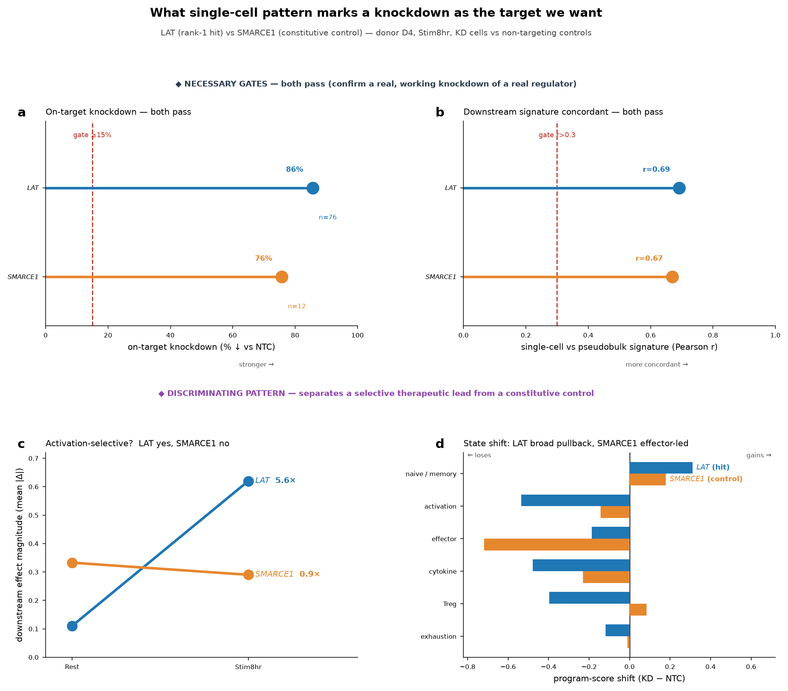

# IMMUNOLOGY_PRIMER.md — Reading this Perturb-seq screen for target discovery

*A background primer for team members new to T-cell immunology. Covers: (1) what
CD4⁺ T-cell activation is, (2) the two independent "clocks" in this experiment
— perturbation vs stimulation, (3) what a drug target is here, and (4) which
single-cell patterns mark a knockdown as a target we want. All quantitative
claims are drawn from this project's own Phase D/E results and from the paper's
Methods (bioRxiv 10.64898/2025.12.23.696273; full text saved as
`paper_fulltext.txt`).*

---

## 1. What "activation" is, and why it drives the whole logic

CD4⁺ T cells (helper T cells) have two fundamentally different states:

- **Rest** — quiet, at baseline; not dividing, not secreting effector cytokines.
  Most T cells in the body sit here most of the time.
- **Activated (Stimulated)** — ignited by antigen: signal transduction →
  proliferation → differentiation into effector subsets (Th1/Th2/Th17/Treg) →
  secretion of IFNγ, IL-4, IL-17, etc.

**How activation is triggered — the "two-signal" model** (this is literally what
the experiment mimics):
- Signal 1: the T-cell receptor (TCR) recognizes antigen.
- Signal 2: CD28 co-stimulation.

In vitro there is no real antigen, so **anti-CD3 (mimics TCR) + anti-CD28
antibodies** are used to ignite the cells — this is the "TCR/CD28 (re-)stimulation"
in the docs. **Rest = no stimulus given; Stim = stimulus given, sampled 8 h / 48 h
later.**

**The molecular cascade on activation (this is the key to understanding targets).**
The instant the TCR fires, the proximal signaling pathway discharges:
the CD3 complex (incl. **CD3E, CD247/CD3ζ**) ITAMs are phosphorylated → recruit
**ZAP70** → ZAP70 phosphorylates the scaffold **LAT** → LAT nucleates the
**PLCG1, VAV1** "signalosome" → Ca²⁺ flux (→ calcineurin → NFAT) and DAG
(→ NF-κB, AP-1) → these transcription factors drive the entire activation
program (IL2, IL2RA/CD25, proliferation, differentiation…).

Note those names: **LAT, PLCG1, CD247, CD3E, ZAP70, VAV1 are the 6 TCR-proximal
targets among this project's 7 Phase D flagship targets** (the 7th, SMARCE1, is a
constitutive chromatin regulator carried as a specificity control — see §4). They
are all proximal TCR signaling molecules; that is not a coincidence.

---

## 2. Two independent clocks — perturbation ≠ stimulation

A common misconception: "cells are perturbed at 0 h and then sampled." **Not so.**
There are **two separate clocks**, and **two rounds of stimulation**:

- **Perturbation clock** — the CRISPRi knockdown is established very EARLY and is a
  persistent background by readout time.
- **Stimulation clock** — the Rest / Stim8hr / Stim48hr axis is a LATE
  *re-stimulation*, applied ~11 days after the knockdown was installed.

### Verified timeline (day numbers from the paper's Methods, "Genome-scale perturb-seq")

| Day | What happens | Which clock |
|---|---|---|
| **0** | Isolate naive CD4⁺ T; seed 30 M with IL-2; **initial activation** with ImmunoCult CD3/CD28/CD2 (25 µl/ml) | **1st stimulation** — needed so naive cells can be transduced |
| **1** | Next morning: transduce ZIM3-KRAB-dCas9 (CRISPRi machinery); afternoon: transduce genome-scale gRNA library (MOI ≈ 0.2) | **← perturbation installed here** |
| **3** | Add IL-2; add blasticidin (10 µg/mL, selects dCas9) + puromycin (2 µg/mL, selects guide) | selection enriches the KD population |
| **5 / 7 / 8 / 10** | Repeated dilution + expansion in IL-2 + IL-7, **no CD3/CD28** | **rest/expansion** — initial activation signal decays |
| **12 AM** | Resuspend, split into three populations → | terminal readout |
| **12** | ① **Rest**: no re-stimulation, harvest +8 h; ② **Stim8hr**: re-stimulate (CD3/CD28/CD2, 12.5 µl/ml), harvest +8 h; ③ **Stim48hr**: re-stimulate, harvest +48 h | **2nd stimulation** — this is the Rest/8h/48h axis |

(Rest is also harvested +8 h after the day-12 split, so it is a clean
time-matched control for Stim8hr — same time, minus the activator.)

### Why it must be designed this way (not simultaneous)
1. **Technically forced.** Resting primary human T cells transduce very poorly, so
   cells must be activated first (day 0) to install the CRISPRi system and expand to
   genome-scale numbers.
2. **CRISPRi needs time to take effect.** It represses transcription; existing
   protein/mRNA must decay, which takes days. So the knockdown is a **persistent
   background state**, not an instantaneous event — by readout (day 12) it has been
   stable ~11 days.
3. **Clean context contrast.** Because the knockdown is a *fixed background* before
   re-stimulation begins, the Rest→Stim8hr→Stim48hr contrast cleanly reads out
   "with gene X depleted, how does the cell's activation response change" — knockdown
   fixed, re-stimulation the only variable. This is the experimental basis for the
   paper's title phrase "context-specific regulators."

**One line:** perturbation is early and persistent; Rest/8h/48h is the terminal
re-stimulation clock, with the knockdown already stable for days at sampling — two
clocks, not simultaneous.

---

## 3. What we are looking for — the definition of a target

**target = an upstream regulator whose knockdown (= a genetic model of drug-induced
loss-of-function) moves a T-cell program we want to change in a therapeutically
favorable direction, reproducibly and druggably.**

The core move is **reading the perturbation→program map backwards**: start from the
program we want to change, find the upstream gene controlling it. Because CRISPRi
only models *inhibition*, targets split into two therapeutic directions:

| Direction | Desired effect | After knockdown you want to see | Drug form |
|---|---|---|---|
| **Suppress inflammation** (autoimmune/allergy) | turn off a pathogenic program | KD **lowers** IFNG/IL17/IL4/IL13; pulls cells back toward rest | inhibitor |
| **Enhance immunity** (immuno-oncology / immunodeficiency) | release a brake | KD **raises** IL2/IL2RA/effector output (i.e. the gene is a negative regulator) | inhibitor |

**Direction decides inhibit-vs-activate.** If knocking a gene down *weakens* an
output we want to boost, the therapeutic move is to **activate** it (agonist) —
harder to drug. Every candidate must record inhibit/activate, because the screen
only ever tells you "what happens when you deplete it."

---

## 4. Which single-cell patterns mark a knockdown as the target we want

All readouts compare, within one donor × condition, **cells carrying a gene's guide
(KD cells)** against **non-targeting-control (NTC) cells**. NTC is the baseline; no
pattern means anything without it. Criteria come in three layers.

### Layer 0 · Necessary gates (fail → do not interpret)
1. **On-target knockdown really happened** — target transcript lower in KD than NTC.
   Phase D flagships: 76–94% knockdown (MWU p<1e-8 for 6/7). If the knockdown failed,
   nothing downstream is interpretable — discard.
2. **Reproducible** — two guides agree AND donors agree. This is the main defense
   against artifacts; the paper itself flags non-replicating trans-effects (IL2RA,
   NFAT5, TNFAIP3) that cannot be trusted even when large.
3. **Off-target clean** — no `distal_offtarget_flag` / `neighboring_gene_KD` /
   `low_target_gex`.

### Layer 1 · Hit signals (more/stronger → more likely a real target)
4. **Coordinated, reproducible downstream change** — a whole set of downstream genes
   moves together AND matches the pseudobulk DE signature (Phase D/E concordance,
   Pearson r 0.43–0.85; MED24 in the novel axis r≈0.80).
5. **Right program, right direction** — see the table in §3.
6. **Context dependence (therapeutic window)** — effect is stronger in, or exclusive
   to, the activated state. This is the most-valued class: a drug hits only the
   activated, disease-driving cells and spares the resting repertoire. LAT/PLCG1 etc.
   are 4.2–8.9× stronger in Stim8hr than Rest. (Paper corroboration: positive
   regulators appear mostly after re-stimulation; trans-effects peak 8 h post-stim;
   8 h changes early activation markers IL2RA/LAG3, 48 h changes metabolic /
   oxidative-phosphorylation genes — so *which timepoint* a target acts at points to
   "signaling" vs "differentiation" class.)
7. **Cell-state redistribution** — KD cells move coherently on the state manifold in
   a favorable direction (TCR-proximal KDs push cells from activated/effector back
   toward naive/memory). Harder evidence than a few genes, because it's whole-cell
   fate.
8. **Hub-ness / magnitude** — a large number of downstream genes (big trans-effect)
   → a mechanistic hub; one drug moves a whole program.

### Layer 2 · Anti-patterns (not what we want, or it's a control)
- **Constitutive, activation-independent** — equal effect in Rest and Stim. SMARCE1
  is exactly this (0.87×). A real regulator, but NOT the "hits-only-activated-cells"
  class — used as a **specificity control**, not a lead.
- **Non-reproducible** across guides/donors → likely artifact (IL2RA/NFAT5/TNFAIP3).
- **Essential / broadly toxic** — knockdown broadly harms the cell (CHD4, SMARCB1
  flagged for essentiality/toxicity); "effective" may just mean "cells are dying."
- **Failed knockdown / off-target hit** → out at Layer 0.

### Integration (the Scorecard)
Turn the above into scores (effect strength, reproducibility, context specificity,
hub score, GWAS disease genetics, druggability tier) and rank. **Strongest = surfaces
in several directions at once** — of 301 candidates, LAT/PLCG1/SENP5 hit all four.

### Worked contrast — LAT (ideal hit) vs SMARCE1 (control)

*Panels a–b: both pass the necessary gates (LAT 86% / SMARCE1 76% on-target
knockdown; concordance r=0.69 / 0.67) — both are real, working knockdowns of real
regulators. Panels c–d: the discriminating pattern. **c** — LAT's downstream effect
is 5.6× larger after stimulation (activation-selective, the desired therapeutic
window); SMARCE1 is flat at 0.9× (constitutive). **d** — LAT's KD cells show a broad,
coordinated pullback (gain naive/memory +0.31; lose activation −0.53, effector −0.19,
cytokine −0.48 and Treg −0.40 together), the profile a therapeutic inhibitor would
exploit; SMARCE1's shift has a different shape — dominated by a large effector drop
(−0.72) with only a mild activation change (−0.14) and a near-zero/slightly-positive
Treg (+0.08), i.e. it does not reproduce LAT's activation-led signature, consistent
with a separate, non-TCR mechanism. LAT is the rank-1 target; SMARCE1 is the
specificity control.*

**One line:** the target we want is an upstream regulator that — given a successful,
guide/donor-reproducible, off-target-clean knockdown — moves a pathogenic (or
to-be-enhanced) program in the correct direction, selectively in the activated
state, coordinately, with a favorable whole-cell state shift; constitutive,
non-reproducible, or toxic knockdowns are not what we want even if they look
"effective."

---

## Sources
- Project Phase D results: `phaseD_outputs/PHASE_D_RESULTS.md` and its
  `sc_kd_efficiency.csv`, `sc_concordance.csv`, `sc_stim_dependence.csv`,
  `sc_state_shifts.csv` (the numbers in §4 and the figure).
- Project Phase C scorecard: `phaseBC_outputs/TARGET_SCORECARD.csv` (LAT rank 1,
  SMARCE1 rank 2).
- Paper Methods & main text: bioRxiv 10.64898/2025.12.23.696273 (full text
  `paper_fulltext.txt`); timeline in §2 from the "Genome-scale perturb-seq" Methods
  section; corroboration in §4 from the trans-effect timing results.
