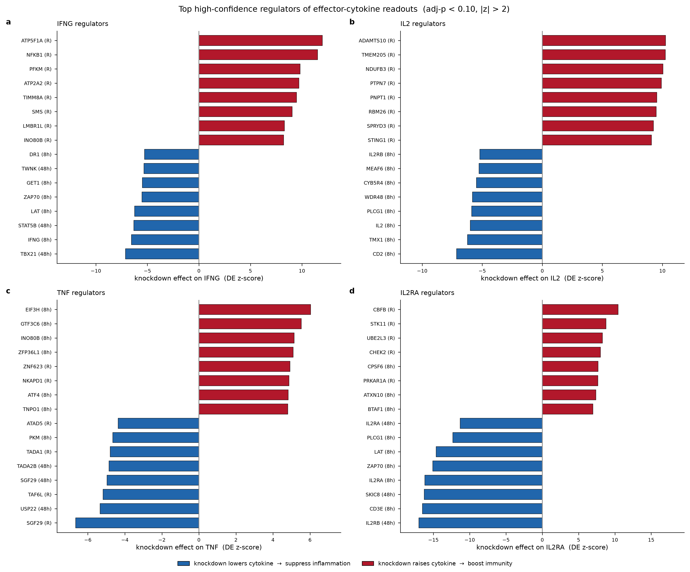
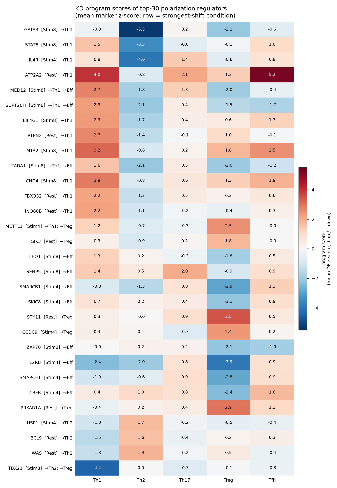
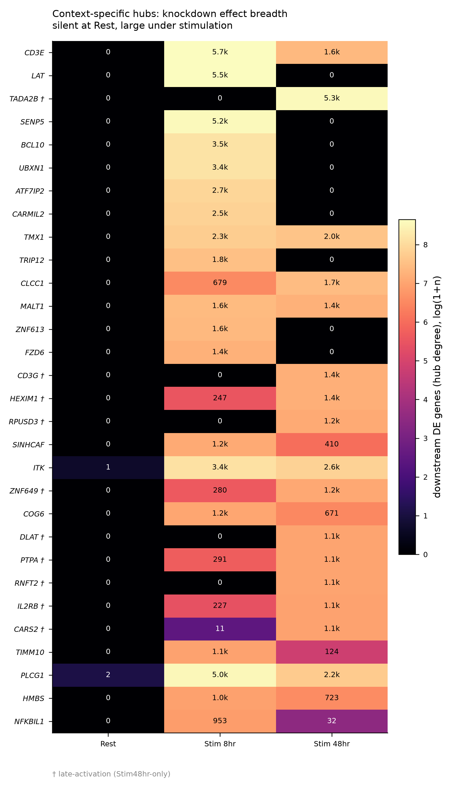
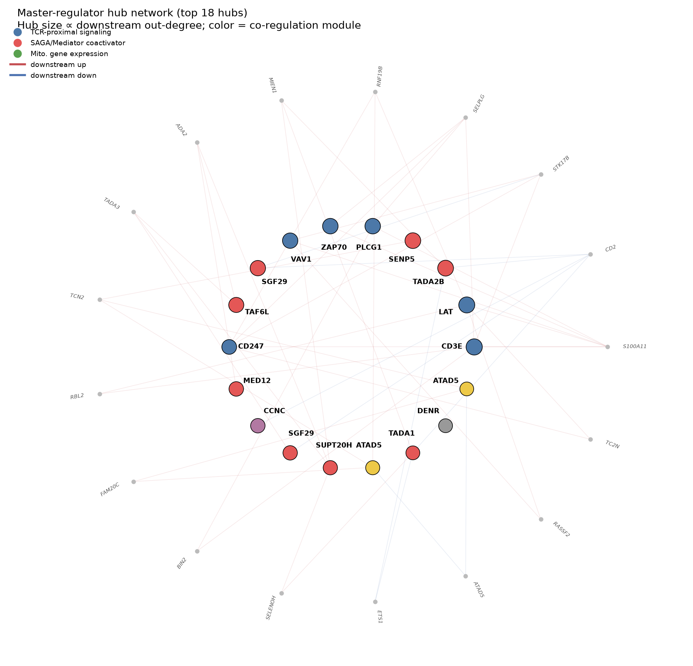

# PHASE B — Six Discovery Directions (Target Nomination)

**Project:** Novel drug targets in CD4⁺ T-cell genome-scale CRISPRi Perturb-seq (Marson–Pritchard atlas)
**Scope:** Nominate candidate regulators from the vetted high-confidence perturbation set along **six complementary lenses** on the genome-wide DE matrix, and annotate each candidate with human-genetics and druggability evidence.
**Data:** `GWCD4i.DE_stats.h5ad` — 33,983 (perturbation × context) contrasts × 10,282 measured genes (precomputed DESeq2; `zscore` layer as the effect measure). **Compute:** `ssh:clust1-rocm-4`, env `perturb-seq`. **Outputs:** `phaseBC_outputs/`.

## Why this phase

Phase A produced the **candidate universe**: 12,576 high-confidence perturbation×context profiles (reproducible across guides & donors, on-target-significant, off-target-clean) spanning **5,728 unique genes**. Phase B reads the perturbation→program map *backwards* — from a therapeutically desirable program to the upstream regulators that control it — through six lenses. Four are **discovery** directions run over the DE matrix (D1 cytokines, D2 polarization, D3 context, D4 network); two are **annotation** directions that add external evidence to the convergent candidates (D5 human genetics, D6 druggability). A target surfacing in several directions is stronger, and that convergence is what Phase C integrates.

**Convention.** CRISPRi models loss-of-function only, so every nomination records a therapeutic **direction**: whether the beneficial effect would come from *inhibiting* the target (knockdown suppresses a pathogenic program) or *activating* it (knockdown boosts a desirable program). A **significant DE edge** = adj_P < 0.10 AND |z| > 2.0 (1,302,641 edges genome-wide), used for network out-degree and module detection.

## Headline

| Direction | Question | Result |
|---|---|---|
| **D1 — Cytokine master regulators** | Which knockdowns shift effector-cytokine output? | **3,900** gene×condition×cytokine effects (1,326 genes) |
| **D2 — Polarization regulators** | Which bias Th1/Th2/Th17/Treg/Tfh fate? | **1,109** lineage-shifting knockdowns (916 genes) |
| **D3 — Context-specific targets** | Which act only in activated vs resting cells? | **5,728** genes classified; **580** activation-induced |
| **D4 — Network hubs** | Which are master regulators by downstream reach? | **12,576** hubs; 4 co-regulation modules recover known complexes |
| **D5 — Human genetics** | Which carry autoimmune/allergic GWAS signal? | **127/301** priority candidates with genetic support |
| **D6 — Druggability** | Which are tractable / novel / already-drugged? | **178** novel-druggable; **27** known drug targets recovered *de novo* |

---

## D1 — Master regulators of effector cytokine programs

**Method.** For each high-confidence perturbation, the signed effect (`zscore` layer) on ten therapeutically central cytokines/receptors — IL2, IFNG, IL4, IL13, IL17A, IL21, TNF, IL10, IL2RA, CTLA4 (plus CSF2, IL3, IL5, IL22, IL23R, LTA in the effector set) — was tabulated at each condition. A downward effect on an effector cytokine → **suppress-inflammation** candidate; an upward effect → **boost-immunity** candidate. The strong-candidate bar is **≥2 effector cytokines moved**.

**Result.** **3,900** significant gene×condition×cytokine effects across **1,326 unique genes**. By therapeutic logic, **2,410 suppress-inflammation** vs **1,490 boost-immunity**; by sign, **2,578 down / 1,322 up**; by cytokine class, **3,464 effector / 436 suppressive**. Coverage is spread across all readouts (most-hit: IL3 440, IL5 382, IL2RA 375, IL22 323, IL2 316, IFNG 302; least: IL23R 56, TNF 164). **1,758 genes** clear the ≥2-cytokine summary bar.

**Top suppressors** (Σ|z| over suppressed effector cytokines; a broad, strong suppressor profile):

| Gene | Cond. | #cytokines↓ | Σ\|z\| | Cytokines suppressed |
|---|---|---|---|---|
| CD3E | Stim8hr | 11 | 55.4 | CSF2, IFNG, IL13, IL2, IL21, IL2RA, IL3, IL4, IL5, LTA, TNF |
| PGK1 | Stim8hr | 10 | 47.4 | CSF2, IFNG, IL13, IL2, IL22, IL2RA, IL4, IL5, LTA, TNF |
| VAV1 | Stim8hr | 12 | 45.6 | (all 12 effector cytokines) |
| LAT | Stim8hr | 9 | 44.5 | CSF2, IFNG, IL13, IL2, IL2RA, IL3, IL4, LTA, TNF |
| IL2RB | Stim48hr | 7 | 43.2 | CSF2, IL13, IL2RA, IL3, IL4, IL5, TNF |
| SMARCE1 | Stim8hr | 9 | 41.7 | CSF2, IFNG, IL13, IL2, IL22, IL2RA, IL3, IL4, LTA |
| ZAP70 | Stim8hr | 7 | 41.6 | CSF2, IFNG, IL2, IL21, IL2RA, IL3, IL4 |
| PLCG1 | Stim8hr | 9 | 41.5 | CSF2, IFNG, IL2, IL2RA, IL3, IL4, IL5, LTA, TNF |

The suppressor leaderboard is dominated by the **TCR-proximal signalosome** (CD3E, VAV1, LAT, ZAP70, PLCG1, CD247) plus a metabolic/chromatin tail (PGK1, PKM, SMARCE1) — knockdown broadly collapses effector-cytokine output, the anti-inflammatory profile.

**Top boosters** (knockdown *raises* effector cytokines → immuno-oncology logic) are led by mitochondrial/metabolic genes at Rest — TMEM205 (Σ|z| 40.3), ATP5F1A (39.7), SMS (34.2), PFKM (31.2) — plus stimulation-context boosters CPSF6, UFM1, NFKB2, and the aryl-hydrocarbon receptor AHR.

---

## D2 — Regulators of helper-lineage polarization

**Method.** Curated program gene-sets — Th1 (TBX21, IFNG, CXCR3), Th2 (GATA3, IL4, IL5, IL13), Th17 (RORC, IL17A/F, IL23R), Treg (FOXP3, IL2RA, IKZF2), Tfh (BCL6, CXCR5) — were scored on the DE `zscore` layer per perturbation, and each knockdown assigned a primary polarization axis (Th1-vs-Th2 or Effector-vs-Treg) and a shift label. Strong-candidate bar = **|z| ≥ 3** program shift.

**Result.** **1,109** lineage-shifting knockdowns across **916 unique genes**, split near-evenly between the two axes (**Th1-vs-Th2 563**, **Effector-vs-Treg 546**). Shift-label breakdown: **→Th1 291, →Effector 278, →Th2 238, →Treg 235**, plus 67 dual-axis shifts. Therapeutic assignment: 315 boost-immunity, 291 skew-Th1 (pro-inflammatory), 265 suppress-inflammation, 238 skew-Th2.

**Strongest shifts:**

| Gene | Cond. | Shift | \|z\| | Axis |
|---|---|---|---|---|
| STK11 | Rest | →Treg | 7.7 | Effector-vs-Treg |
| PRKAR1A | Rest | →Treg | 7.1 | Effector-vs-Treg |
| IL4R | Stim48hr | →Th1 | 7.0 | Th1-vs-Th2 |
| GATA3 | Stim8hr | →Th1 | 6.4 | Th1-vs-Th2 |
| STAT6 | Stim8hr | →Th1 | 6.3 | Th1-vs-Th2 |
| TBX21 | Stim8hr | →Th2; →Treg | 6.0 | Th1-vs-Th2 |

The axis reproduces canonical immunology *de novo*: knocking down the Th2 master regulators **GATA3** and **STAT6** (and the IL-4 receptor **IL4R**) skews toward Th1, while knocking down the Th1 master regulator **TBX21** skews toward Th2/Treg — the expected reciprocal Th1/Th2 antagonism. The strongest Treg-promoting hits, the energy-sensing kinase **STK11/LKB1** and PKA regulatory subunit **PRKAR1A**, are metabolic regulators whose loss expands the regulatory program.

---

## D3 — Context-specific (stimulation-dependent) regulators

**Method.** Each gene's downstream reach (`n_downstream`) was contrasted across Rest → Stim8hr → Stim48hr and a **context-specificity score** computed; genes were classed **constitutive / activation-induced / late-activation / rest-specific / mixed / weak**. Activation-induced targets are the most attractive therapeutically — a drug would act on activated, disease-driving T cells while sparing the resting repertoire. Strong bar = activation-family with specificity ≥ 0.8 AND stim reach ≥ 50.

**Result.** **5,728** genes classified: **630 constitutive, 580 activation-induced, 405 late-activation, 311 rest-specific, 232 mixed, 3,570 weak**. Of the 580 activation-induced genes, **231** clear the strong specificity+reach bar. Every classified gene carries an "inhibit" therapeutic assignment tagged by its context class (e.g. *activation-specific*, *late-activation-specific*).

**Top activation-induced targets** (by max stimulated downstream reach; specificity in parentheses):

| Gene | Stim downstream | Specificity | Present in |
|---|---|---|---|
| CD3E | 5,710 | 1.00 | Stim8hr, Stim48hr |
| LAT | 5,535 | 1.00 | Stim8hr |
| SENP5 | 5,171 | 1.00 | Stim8hr |
| PLCG1 | 5,032 | 1.00 | all three |
| CD247 | 4,329 | 1.00 | all three |
| BCL10 | 3,455 | 1.00 | Stim8hr |
| UBXN1 | 3,443 | 1.00 | Stim8hr |
| ITK | 3,392 | 1.00 | all three |

The activation-induced leaders are again the TCR-proximal signalosome (CD3E, LAT, PLCG1, CD247, BCL10, ITK) — genes with essentially no downstream reach at Rest that explode into thousands of downstream DE genes once the TCR is engaged. This is the pattern later confirmed per-cell in Phase D (LAT: 3 downstream genes at Rest → 5,535 at Stim8hr). **SENP5** appears here as a large-magnitude non-canonical outlier flagged in Phase A.

---

## D4 — Network hubs / master regulators (topology)

**Method.** The perturbation→downstream-gene bipartite network was built from significant DE edges (adj_P < 0.10, |z| > 2.0; 1,302,641 edges). Out-degree (`n_downstream`) ranks hub-ness; co-regulation **modules** were detected by scipy hierarchical clustering on the Jaccard distance of downstream signatures (cut t = 0.70). Strong bar = top-200 hubs.

**Result.** **12,576** hubs scored. Out-degree is heavy-tailed — **median 3, mean 103.6, max 5,601** — i.e. most perturbations move a handful of genes while a small elite each rewire thousands. Module detection recovers **four known protein complexes purely from co-regulation similarity**, with no prior annotation:

| Module | Name | Members (in top hubs) |
|---|---|---|
| 81 | **TCR-proximal signaling** | 20 |
| 86 | **SAGA/Mediator co-activator** | 15 |
| 31 | Mitochondrial gene expression | 4 |
| 85 | DNA replication/repair | 3 |

**Top hubs** interleave the two dominant modules:

| Rank | Gene | Cond. | Out-degree | Module |
|---|---|---|---|---|
| 1 | CD3E | Stim8hr | 5,601 | TCR-proximal |
| 2 | LAT | Stim8hr | 5,445 | TCR-proximal |
| 3 | TADA2B | Stim48hr | 5,217 | SAGA/Mediator |
| 4 | SENP5 | Stim8hr | 5,172 | SAGA/Mediator |
| 5 | PLCG1 | Stim8hr | 5,013 | TCR-proximal |
| 6 | ZAP70 | Stim8hr | 4,993 | TCR-proximal |
| 7 | VAV1 | Stim8hr | 4,873 | TCR-proximal |
| 8 | SGF29 | Stim48hr | 4,869 | SAGA/Mediator |
| 9 | TAF6L | Stim8hr | 4,639 | SAGA/Mediator |
| 10 | CD247 | Stim8hr | 4,330 | TCR-proximal |

That the network self-organizes into the TCR signalosome and the SAGA/Mediator transcriptional co-activator complex — from downstream-signature overlap alone — is a strong internal validation and foreshadows the **two mechanistic axes** that structure the Phase C scorecard.

---

## D5 — Human-genetics integration (disease relevance)

**Method.** For the 301-gene priority set (≥2 discovery directions), GWAS Catalog associations were pulled per gene and filtered to immune-disease traits (RA, IBD/Crohn's/UC, MS, T1D, SLE, asthma/allergy, psoriasis) via keyword matching. Each candidate carries an immune-association count, minimum immune p-value, and per-disease-category breakdown (0 API errors).

**Result.** **127 / 301** priority candidates carry immune-genetics support; **82** have ≥1 disease-level immune association. Aggregated across the set, the disease-category load is dominated by **asthma/allergy (406 associations)**, then RA (117), IBD (114), other-autoimmune (106), SLE (49), psoriasis (44), MS (38), T1D (31) — consistent with CD4⁺ T-cell biology sitting upstream of allergic and autoimmune traits.

**Strongest genetic support** (by disease-association count and by peak significance):

| Gene | #Immune dis. assoc. | Max −log₁₀P | Lead categories |
|---|---|---|---|
| PTPN2 | 88 | 27.1 | IBD, RA, T1D, psoriasis |
| IL2RA | 74 | 55.5 | asthma-allergy, psoriasis, RA |
| STAT6 | 55 | 38.5 | asthma-allergy (all 55) |
| IL4R | 48 | 33.7 | asthma-allergy, IBD |
| CD247 | 46 | 24.7 | asthma-allergy, other-autoimmune, RA |
| IL7R | 44 | **98.5** | asthma-allergy, MS |
| SMARCE1 | 37 | 67.5 | asthma-allergy, T1D, IBD |
| STAT3 | 37 | 39.0 | IBD, asthma-allergy, MS |

The most significant single locus is **IL7R** (−log₁₀P 98.5), a canonical MS/autoimmune locus; **SMARCE1** (−log₁₀P 67.5, 37 associations) is notable because it is a *novel*, drug-naive chromatin regulator carrying strong population-genetics support — exactly the combination Phase C prioritizes. Canonical immune loci (IL2RA, STAT6, IL4R, PTPN2) validate that the genetics layer is calibrated.

---

## D6 — Druggability & tractability annotation

**Method.** The 301 priority candidates were annotated via Open Targets Platform (small-molecule/antibody tractability buckets + known drugs) and ChEMBL (target class / mechanism). `novel-druggable` = no approved/clinical/known drug **AND** (small-molecule OR antibody tractable). `known-drug-target` = has an approved/clinical/known drug.

**Result.** Of 301 candidates: **178 novel-druggable**, **27 already drug targets** (23 with clinical-stage drugs), and 96 currently difficult. Tractability is broad — **152 small-molecule tractable, 107 antibody tractable**. Protein-class split: 162 SINGLE PROTEIN, 131 inferred protein-coding, 6 protein complexes; all 301 are protein-coding. The best small-molecule evidence bucket is most often **"Structure with Ligand" (122 genes)**, with 9 at "Approved Drug", 8 "High-Quality Ligand", and 5 "Advanced Clinical" — i.e. the majority already have a ligand-bound structure, a strong starting point for medicinal chemistry.

**Known drug targets recovered *de novo*** (validation that the CRISPRi-LOF logic finds real druggable biology): CD3E (22 drugs), CD3G (16), PARP2 (12), IL2RB (10), LCK (8), IL2RA (7), IMPDH2 (7), ITK (4), MEN1 (3), plus CD2, CD28, IL4R, PTPRC, MALT1, KDM1A, ACLY. These surfaced from perturbation biology alone, without drug-database seeding.

---

## Convergence across directions

The four discovery directions were unioned into **1,021 candidate genes** (any single direction), of which **301 are nominated by ≥2 directions** — the priority set that D5/D6 annotate and Phase C integrates. Within the 301, direction membership is: **288 cytokine, 159 context, 114 network, 105 polarization** (a gene may belong to several). Convergence depth: 720 genes at 1 direction, 240 at 2, **58 at 3, and 3 at all 4** (LAT, PLCG1, SENP5). The multi-direction genes are enriched for the TCR-proximal and SAGA/Mediator modules — the same complexes D4 recovered — confirming that convergence tracks real, coherent biology rather than statistical coincidence.

## Methods (summary)

- **Signal.** Precomputed genome-wide DE (`GWCD4i.DE_stats.h5ad`; DESeq2, FDR 10%), `zscore` layer as the effect measure; Ensembl IDs mapped to symbols via `de.var["gene_name"]`.
- **Universe.** Only Phase A high-confidence perturbations (12,576 profiles / 5,728 genes).
- **Per-direction strong bars.** D1 ≥2 effector cytokines moved; D2 |z| ≥ 3 program shift; D3 activation-family with specificity ≥ 0.8 & stim reach ≥ 50; D4 top-200 hubs (network from adj_P < 0.10 & |z| > 2.0 edges; modules via hierarchical clustering on Jaccard distance, cut t = 0.70).
- **Annotation.** D5 GWAS Catalog (immune-trait keyword filter); D6 Open Targets GraphQL (tractability + known drugs) + ChEMBL (class/mechanism). Both annotate the 301-gene priority set.

## Caveats

- **Reproducibility is the gate, not the score.** Every candidate already passed the Phase A high-confidence filter (two-guide + cross-donor agreement, on-target, flag-clean); Phase B ranks *within* that vetted set, so it does not re-derive reproducibility.
- **Direction is loss-of-function.** All effects are read from CRISPRi knockdown; "boost-immunity" hits are genes whose *loss* raises effector output, so the therapeutic hypothesis is to inhibit them (not to knock them down). Each candidate's inhibit-vs-activate logic is recorded explicitly.
- **GWAS ≠ causal.** D5 is trait-locus overlap by keyword; colocalization/fine-mapping was not performed, so genetic support is corroborative, not proof of a causal variant.
- **Pseudobulk, not single-cell.** All six directions read the pseudobulk DE layer; single-cell confirmation of the flagship calls is Phase D/E.

## Files (`phaseBC_outputs/`)

- `cytokine_regulators.csv` (3,900 effects) · `cytokine_regulators_summary.csv` (1,758 genes) · `cytokine_regulators_bars.png`
- `polarization_regulators.csv` (1,109 shifts) · `polarization_heatmap.png`
- `context_specific_targets.csv` (5,728 genes) · `context_heatmap.png`
- `regulator_network_hubs.csv` (12,576 hubs) · `network_modules_heatmap.png` · `regulator_network.png`
- `gwas_regulator_overlap.csv` (301 candidates) · `gwas_disease_regulator.png`
- `druggability_annotation.csv` (301 candidates) · `druggability_overview.png`
- `candidate_union.csv` (301, ≥2 directions) · `candidate_union_full.csv` (1,021, ≥1 direction)

*Data source: CZI Virtual Cells "Primary Human CD4⁺ T Cell Perturb-seq" (Zhu, Dann, Yan, Reyes Retana, Goto, Guitche, Petersen, Ota, Shy, Pritchard, Marson; bioRxiv 2025.12.23.696273). Continues into Phase C (integration & scorecard).*
