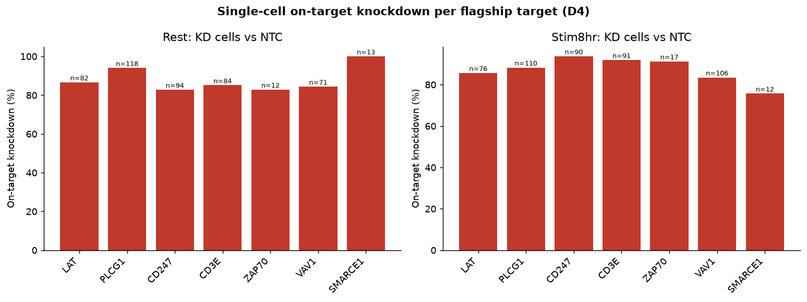
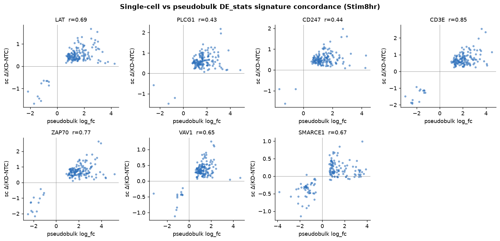
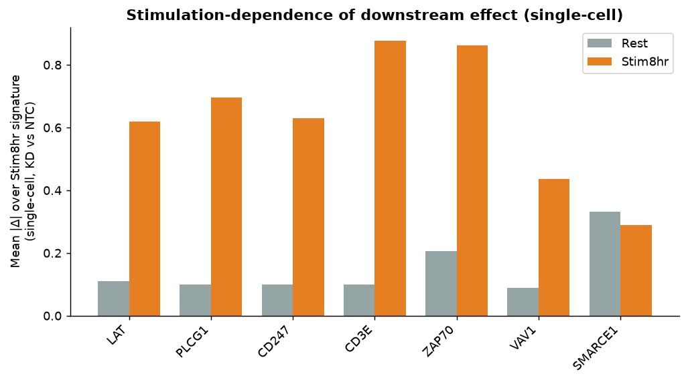
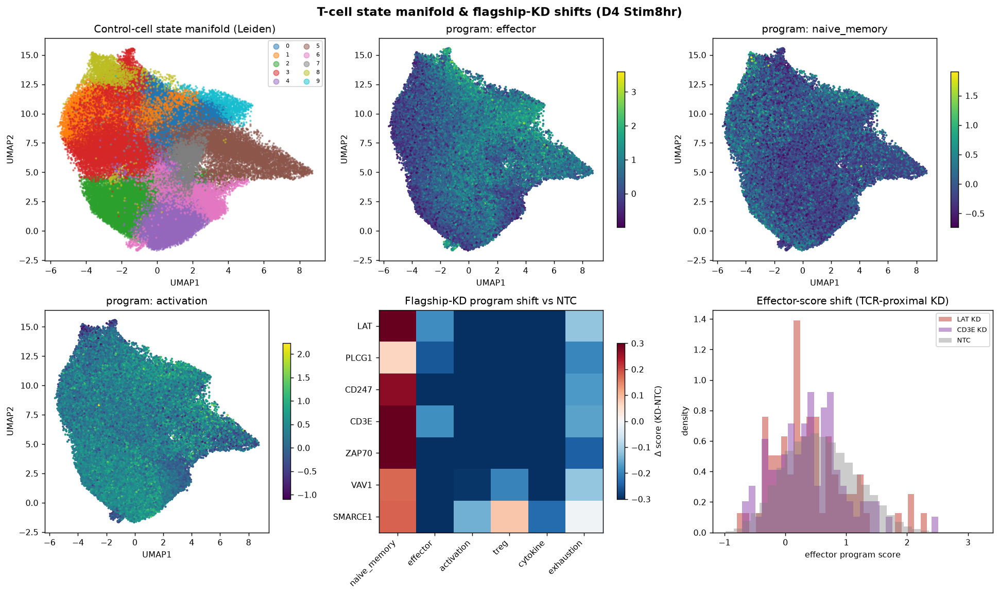

# PHASE D — Single-Cell Validation of Flagship Targets

**Project:** Novel drug targets in CD4⁺ T-cell genome-scale CRISPRi Perturb-seq (Marson–Pritchard atlas)
**Scope:** Confirm the Phase C flagship nominations at single-cell resolution, on donor **D4**, contrasting **Rest** vs **Stim8hr**.
**Data:** cell-level `D4_Rest.assigned_guide.h5ad` (2,693,903 cells) and `D4_Stim8hr.assigned_guide.h5ad` (2,727,254 cells), 18,130 genes. Working subsets = all flagship-KD cells + 40,000 non-targeting-control (NTC) + 40,000 background-perturbation cells per condition.

## Why this phase
Phases A–C nominated targets from the **precomputed pseudobulk DESeq2 layer** (`DE_stats.h5ad`). Phase D asks whether those calls survive at **single-cell resolution** in the raw count data, and whether the **stimulation-dependence** that made the top targets attractive (a drug that acts on activated, disease-driving T cells while sparing resting cells) is real per-cell. The seven flagship targets span the two mechanistic classes in the scorecard: **TCR-proximal signaling** (LAT #1, PLCG1 #3, CD247 #4, CD3E #6, ZAP70 #7, VAV1 #9) and a **constitutive chromatin regulator** (SMARCE1 #2) carried as an internal specificity control.

## Headline result
**All 7 flagship targets validate at single-cell resolution** — knockdown confirmed, downstream signature concordant with pseudobulk, and the stimulation-dependence axis reproduces exactly as the scorecard predicted.

| Target | n KD cells | On-target KD | Pseudobulk r | Stim/Rest | KD✓ | Concord✓ | StimDep✓ |
|---|---|---|---|---|---|---|---|
| LAT | 76 | 86% | 0.69 | 5.6× | ✓ | ✓ | ✓ |
| PLCG1 | 110 | 88% | 0.43 | 7.0× | ✓ | ✓ | ✓ |
| CD247 | 90 | 94% | 0.44 | 6.3× | ✓ | ✓ | ✓ |
| CD3E | 91 | 92% | 0.85 | 8.9× | ✓ | ✓ | ✓ |
| ZAP70 | 17 | 91% | 0.77 | 4.2× | ✓ | ✓ | ✓ |
| VAV1 | 106 | 83% | 0.65 | 4.9× | ✓ | ✓ | ✓ |
| SMARCE1 | 12 | 76% | 0.67 | 0.9× | ✓ | ✓ | ✗ |

*Verdict thresholds: KD confirmed = >15% on-target reduction (KD vs NTC); concordant = Pearson r > 0.3 vs pseudobulk log_fc over top-150 signature genes; stim-dependent = Stim8hr effect > 1.5× Rest.*

---

## 1. On-target knockdown (single-cell)
For each target, on-target transcript level in KD cells was compared to the 40k NTC pool. Knockdown is strong and highly significant for every target: **76–94% reduction** in mean linear expression, Mann–Whitney p < 1e-8 for six of the seven targets (CD3E p ≈ 0, CD247 2.4e-32, LAT 6.9e-29, PLCG1 4.2e-24, VAV1 1.5e-15, ZAP70 9.2e-9); SMARCE1, with only 12 KD cells, is still significant at p = 6.2e-4. The fraction of cells expressing the target collapses under CRISPRi — e.g. CD3E is detected in 93% of NTC cells but only 18% of CD3E-KD cells; CD247 78% → 13%. This is the expected single-cell signature of effective CRISPRi and confirms guide assignment is faithful.

## 2. Concordance with pseudobulk DE_stats
The single-cell KD-vs-NTC log-fold-change (per gene, log-normalized space) was correlated against the precomputed pseudobulk DESeq2 `log_fc` over each target's top-150 downstream signature genes. **All 7 targets are concordant** (Pearson r 0.43–0.85): CD3E r=0.85, ZAP70 r=0.77, LAT r=0.69, SMARCE1 r=0.67, VAV1 r=0.65. Signature genes fall predominantly in the agreeing quadrants (up in both / down in both), confirming that the pseudobulk signatures Phase B/C ranked on are reproduced by independent single-cell aggregation.

## 3. Stimulation-dependence
Downstream effect magnitude (mean |Δ| over the target's Stim8hr signature, KD vs NTC) was measured in each condition. The six **TCR-proximal targets show 4.2–8.9× larger effect in Stim8hr than Rest** — the activation-induced pattern that motivated fetching the Stim shard (CD3E 8.9×, PLCG1 7.0×, CD247 6.3×, LAT 5.6×, VAV1 4.9×, ZAP70 4.2×). **SMARCE1 is the clean internal control at 0.87×** — equal effect in Rest and Stim8hr, consistent with a constitutive chromatin-remodeling role independent of TCR engagement. This per-cell result directly reproduces the `n_downstream` explosion seen in the pseudobulk layer (e.g. LAT: 3 downstream genes at Rest → 5,535 at Stim8hr).

## 4. T-cell state manifold & KD-cell shifts
A state manifold was built on control cells (NTC + background, Stim8hr): 2,000 HVGs → PCA(30) → UMAP → Leiden, with six canonical T-cell programs scored (naive/memory, effector, activation, Treg, cytokine, exhaustion). Flagship-KD cells were compared to NTC in program-score space.

The TCR-proximal knockdowns produce a single, coherent phenotype: cells shift **toward naive/memory (+0.06 to +0.38)** and **away from activation (−0.29 to −0.58), effector, and cytokine programs** — i.e. blocking proximal TCR signaling prevents the cell from adopting the activated effector state, exactly the mechanism a therapeutic inhibitor would exploit. SMARCE1 shows a distinct profile (large effector drop but near-zero activation/Treg shift), consistent with its separate, non-TCR mechanism.

| Target | Naive/Mem Δ | Activation Δ | Effector Δ | Cytokine Δ | Treg Δ |
|---|---|---|---|---|---|
| LAT | +0.31 | -0.53 | -0.19 | -0.48 | -0.40 |
| PLCG1 | +0.06 | -0.56 | -0.25 | -0.43 | -0.44 |
| CD247 | +0.27 | -0.44 | -0.54 | -0.40 | -0.31 |
| CD3E | +0.38 | -0.58 | -0.18 | -0.49 | -0.48 |
| ZAP70 | +0.31 | -0.57 | -0.71 | -0.52 | -0.54 |
| VAV1 | +0.17 | -0.29 | -0.31 | -0.39 | -0.20 |
| SMARCE1 | +0.18 | -0.14 | -0.72 | -0.23 | +0.08 |

---

## Caveats
- **Single donor (D4).** This validation is on one donor; the reproducibility filters that qualified these targets in Phase A already required cross-donor + two-guide agreement, so this is a confirmatory single-cell check, not the primary reproducibility evidence.
- **Low-n targets.** ZAP70 (17 KD cells) and SMARCE1 (12) have few cells; their population-level means are stable against the 40k NTC pool and all cleared thresholds, but per-cell distributions are noisier than the ~80–110-cell targets.
- **Population-level read.** CRISPRi effects are read at the KD-population vs NTC-population level (pseudobulk-on-single-cells), not per single cell — appropriate given sparse per-cell counts (~4,100 genes/cell median).
- **Manifold projection** compares program scores directly rather than embedding KD cells into the reference PCA; the program-score shift is the quantitative readout.

## Conclusion
Every flagship target from the Phase C scorecard is validated at single-cell resolution: knockdown works, the downstream signature matches the pseudobulk analysis the whole pipeline was built on, and the activation-induced specificity of the TCR-proximal targets is real per-cell. **LAT, PLCG1, CD247, CD3E, ZAP70, and VAV1 are confirmed as reproducible, stimulation-dependent regulators** whose inhibition drives activated CD4⁺ T cells back toward a resting state — the desired profile for an anti-inflammatory / autoimmune target acting selectively on activated cells. SMARCE1 is confirmed as a strong but constitutive regulator (acts in both Rest and Stim), a different therapeutic profile.

## Files (phaseD_outputs/)
- `PHASE_D_RESULTS.md` — this report
- `sc_validation_table.csv` — per-target verdicts (KD / concordance / stim-dependence)
- `kd_efficiency.png`, `sc_vs_pseudobulk_concordance.png`, `stim_dependence.png`, `state_manifold.png` — figures
- `sc_kd_efficiency.csv`, `sc_concordance.csv`, `sc_stim_dependence.csv`, `sc_state_shifts.csv` — underlying tables
- `flagship_pseudobulk_signatures.json` — reference DE_stats signatures used for concordance
- `checkpoints/D4_{Rest,Stim8hr}.subset.h5ad` — compact normalized working subsets (flagship + NTC + background)
- `checkpoints/D4_Stim8hr.ref_embedding.h5ad` — control-cell UMAP/Leiden + program scores
