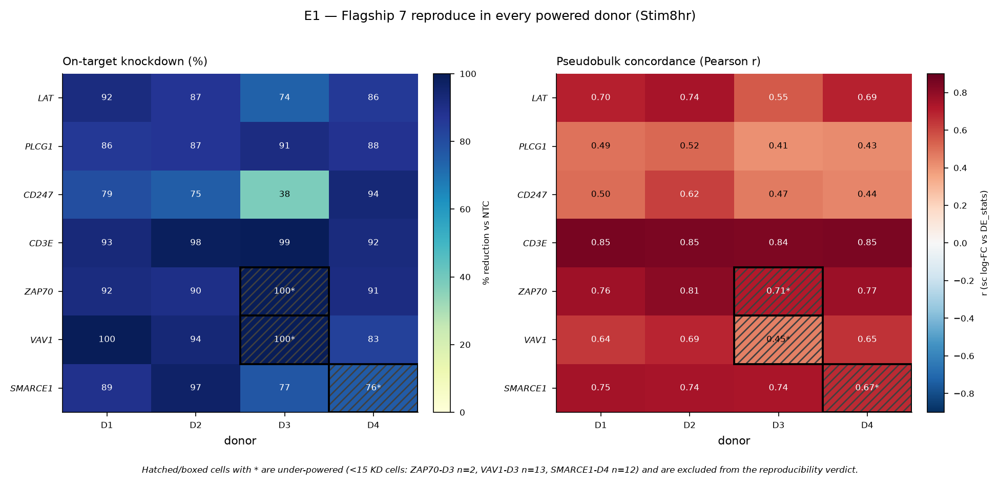
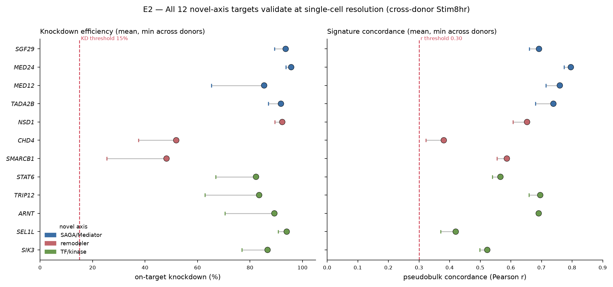
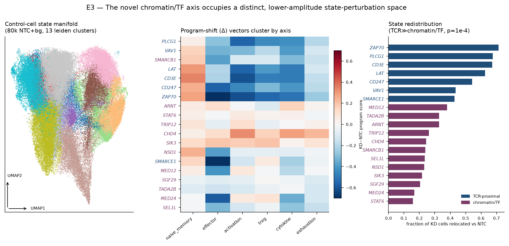

# Phase E — Cross-donor and novel-axis single-cell validation

**CD4⁺ T-cell CRISPRi Perturb-seq drug-target program**

Phase D validated 7 flagship targets at single-cell resolution in one donor (D4). Phase E
extends that validation two ways: **(E1)** it reproduces the flagship 7 across all four donors,
and **(E2/E3)** it delivers the first single-cell validation of the 12-target **drug-naive
chromatin/transcriptional axis** — SAGA/Mediator subunits, chromatin remodelers, and novel
transcription factors/kinases — that Phase D did not test. This novel axis is the program's
central novelty claim.

**Bottom line:** all 7 flagship targets reproduce across donors, and **all 12 novel-axis targets
validate at single-cell resolution** (on-target knockdown confirmed *and* pseudobulk-concordant in
every powered donor). The novel axis is not only real but occupies a **distinct, lower-amplitude
region of T-cell state-perturbation space** from the TCR-proximal flagship targets — exactly the
signature expected of chromatin/transcriptional regulators versus acute signaling genes.

---

## 1. Data and methods

### 1.1 Subsets gathered

Five compact single-cell subsets were streamed from the full cell-level shards (111–172 GB each,
CSR on Lustre) and cached as log-normalized `.h5ad`. Each subset = **all knockdown (KD) cells for
the 19 targets** ∪ **40,000 non-targeting-control (NTC) cells** ∪ **40,000 background cells**
(random targeting cells for other genes), filtered to `low_quality == False`, then
`normalize_total(1e4)` + `log1p` (raw counts retained in a `counts` layer).

| Subset | Cells | Target-KD | NTC | Background | Size | Seed |
|---|---|---|---|---|---|---|
| D1_Stim8hr | 82,715 | 2,715 | 40,000 | 40,000 | 5.96 GB | 1 |
| D2_Stim8hr | 82,640 | 2,640 | 40,000 | 40,000 | 6.13 GB | 2 |
| D3_Stim8hr | 82,398 | 2,398 | 40,000 | 40,000 | 6.21 GB | 3 |
| D4_Stim8hr | 82,689 | 2,689 | 40,000 | 40,000 | 5.36 GB | 4 |
| D4_Stim48hr | 82,522 | 2,522 | 40,000 | 40,000 | 6.15 GB | 5 |

Checkpoints live on the cluster at `$PROJ/phaseE_outputs/checkpoints/{subset}.subset.h5ad`
(not copied off-cluster; 30 GB total). Per-target KD-cell counts by subset are in
`subset_kd_counts.csv`.

**Pipeline validation:** the D4_Stim8hr gather reproduces Phase D's flagship KD-cell counts
*exactly* (LAT 76, PLCG1 110, CD247 90, CD3E 91, ZAP70 17, VAV1 106, SMARCE1 12), and the
downstream KD% / concordance values match Phase D to ≤0.001 (e.g. LAT KD% 0.856 vs 0.856; LAT
concordance r 0.692 vs 0.692). The pipeline is the Phase D pipeline.

### 1.2 The 19 targets

- **Flagship 7 (TCR-proximal signaling + one remodeler):** LAT, PLCG1, CD247, CD3E, ZAP70, VAV1, SMARCE1
- **Novel axis 12:**
  - *SAGA/Mediator:* SGF29, MED24, MED12, TADA2B
  - *Chromatin remodelers:* NSD1, CHD4, SMARCB1
  - *Novel TFs / kinases:* STAT6, TRIP12, ARNT, SEL1L, SIK3

### 1.3 Metrics

- **On-target knockdown (KD%):** relative reduction of the target gene's mean linear expression in
  KD cells vs NTC cells. **Confirmed** if > 15% (one-sided Mann–Whitney p reported alongside).
- **Pseudobulk concordance:** Pearson *r* between the single-cell KD-vs-NTC log-fold-change and the
  bulk DE_stats z-score, over each target's top-150 signature genes (matched on ENSG).
  **Concordant** if *r* > 0.30.
- **Powered donor:** ≥ 15 KD cells for that target in that subset. Under-powered target×donor cells
  are excluded from pass/fail (never silently pooled).
- **Program shifts:** six curated CD4 programs (naive/memory, effector, activation, Treg, cytokine,
  exhaustion) scored per cell; a target's **Δ-vector** = mean(KD) − mean(NTC) score per program.
- **Stim-dependence:** ratio of mean |Δ| over the Stim8hr signature between conditions
  (D4 Stim8hr vs Stim48hr); **stim-dependent** if ratio > 1.5.
- **State manifold:** 2,000 HVG → scale → PCA(50, arpack) → neighbors(15, 40 PC) →
  Leiden(res 1.0) → UMAP(min_dist 0.3), built on **control cells only** (NTC + background) of
  D4_Stim8hr; all cells then projected into the control PCA basis (control mean/std) and assigned
  to the nearest cluster centroid.

---

## 2. E1 — Cross-donor reproduction of the flagship 7

**All 7 flagship targets are fully reproducible across donors** — KD confirmed (> 15%) *and*
concordant (*r* > 0.30) in **every powered donor**.

| Target | Powered donors | KD% (mean, min) | Concordance r (mean, min, CV) | Verdict |
|---|---|---|---|---|
| LAT | 4/4 | 0.85, 0.74 | 0.67, 0.55, CV 0.12 | reproducible |
| PLCG1 | 4/4 | 0.88, 0.86 | 0.46, 0.41, CV 0.11 | reproducible |
| CD247 | 4/4 | 0.72, 0.38 | 0.51, 0.44, CV 0.16 | reproducible |
| CD3E | 4/4 | 0.96, 0.92 | 0.85, 0.84, CV 0.007 | reproducible |
| ZAP70 | 3/4 | 0.91, 0.90 | 0.78, 0.76, CV 0.033 | reproducible |
| VAV1 | 3/4 | 0.92, 0.83 | 0.66, 0.64, CV 0.040 | reproducible |
| SMARCE1 | 3/4 | 0.88, 0.77 | 0.74, 0.74, CV 0.007 | reproducible |

- **CD3E, ZAP70, SMARCE1** are exceptionally stable (concordance coefficient-of-variation 0.007–0.033 across donors).
- **PLCG1, CD247** have lower absolute concordance (~0.46–0.51) but pass in all 4 donors — consistent
  with Phase D, where these two also had the lowest pseudobulk *r*. Their KD% is high (0.72–0.88),
  so the on-target effect is unambiguous; the modest *r* reflects a smaller / noisier distal
  signature, not a reproducibility failure.
- **Under-powered exclusions:** ZAP70 in D3 (2 cells) and VAV1 in D3 (13 cells) drop D3;
  SMARCE1 in **D4** (12 cells) drops D4 — its D3 has 26 cells and *is* powered. D3 generally has the
  weakest guide representation for these three genes; SMARCE1's gap is specifically in D4.

Tables: `E1_flagship_cross_donor_tidy.csv` (per target × donor), `E1_cross_donor_verdict.csv`.

---

## 3. E2 — Single-cell validation of the novel axis

**All 12 novel-axis targets validate at single-cell resolution** — KD confirmed *and* concordant
(*r* > 0.30) in every powered donor. This is the first single-cell evidence for the chromatin/
transcriptional axis.

| Group | Target | KD% mean | Concordance r mean | Powered | Verdict |
|---|---|---|---|---|---|
| SAGA/Mediator | SGF29 | 0.94 | 0.69 | 4/4 | validated |
| SAGA/Mediator | MED24 | 0.96 | **0.80** | 4/4 | validated |
| SAGA/Mediator | MED12 | 0.85 | **0.76** | 4/4 | validated |
| SAGA/Mediator | TADA2B | 0.92 | **0.74** | 4/4 | validated |
| Remodeler | NSD1 | 0.92 | 0.65 | 3/4 | validated |
| Remodeler | CHD4 | 0.52 | 0.38 | 4/4 | validated |
| Remodeler | SMARCB1 | 0.48 | 0.59 | 4/4 | validated |
| TF/kinase | STAT6 | 0.82 | 0.57 | 4/4 | validated |
| TF/kinase | TRIP12 | 0.84 | 0.70 | 4/4 | validated |
| TF/kinase | ARNT | 0.89 | 0.69 | 4/4 | validated |
| TF/kinase | SEL1L | 0.94 | 0.42 | 3/4 | validated |
| TF/kinase | SIK3 | 0.87 | 0.52 | 3/4 | validated |

Key observations:

- **SAGA/Mediator concordance often *exceeds* the flagship.** MED24 (0.80), MED12 (0.76),
  TADA2B (0.74) and SGF29 (0.69) all beat the flagship PLCG1/CD247 (0.46–0.51). These transcriptional
  co-activators produce highly reproducible single-cell signatures.
- **Chromatin remodelers are harder to knock down.** CHD4 (0.52) and SMARCB1 (0.48) have the
  lowest KD% of the 12 — expected for large, essential remodeler complexes — but both remain
  concordant (SMARCB1 *r* = 0.59; CHD4 *r* = 0.38, just above threshold). Their knockdown is real,
  the phenotype is measurable, and the concordance clears the bar.
- **Concordance is stable across donors** (CV 0.01–0.14), matching flagship-level reproducibility.

### 3.1 Stim-dependence (D4 Stim8hr vs Stim48hr)

The magnitude of each target's perturbation signature was compared between the 8 h and 48 h
stimulation time points.

- **Flagship TCR-proximal targets peak early:** mean 8h/48h ratio **2.00**, with 6/7 stim8-dominant
  (CD3E 2.73, CD247 2.34, ZAP70 2.24, PLCG1 2.14, LAT 1.96, VAV1 1.68). SMARCE1 is the lone exception
  (ratio 0.94, flat) — fittingly, it is a SWI/SNF chromatin factor, not a signaling gene.
- **Novel axis is more heterogeneous:** mean ratio **1.72** (7/12 stim8-dominant), and effect
  magnitudes are systematically smaller (mean |Δ| 0.13–0.46 vs flagship 0.28–0.82). This is the
  expected behaviour of chromatin/transcriptional regulators — broad, sustained, lower-amplitude
  transcriptomic effects rather than an acute early-signaling spike.

Tables: `E2_novel_axis_verdict.csv`, `E2_stim_dependence.csv`.

---

## 4. E3 — State-manifold contrast: novel vs TCR-proximal

A 13-cluster Leiden manifold was built on 80,000 D4_Stim8hr control cells; all 19 targets' KD cells
were projected in. Two independent contrasts both show the novel axis is **mechanistically
distinct** from the TCR-proximal flagship targets.

### 4.1 Program-Δ vectors cluster by axis (89% recovery)

Ward clustering of the 19×6 program-Δ vectors into 2 clusters recovers the flagship/novel split at
**17/19 = 89%** (silhouette of the a-priori axis labels 0.349; data-driven 2-cluster 0.389):

- **Cluster 1 (TCR-proximal):** LAT, PLCG1, CD247, CD3E, ZAP70, VAV1 + SMARCB1
- **Cluster 2 (novel/chromatin):** SGF29, MED24, MED12, TADA2B, NSD1, CHD4, STAT6, TRIP12, ARNT, SEL1L, SIK3 + SMARCE1

The **two crossovers are biologically sensible and strengthen the interpretation**:
- **SMARCE1** (flagship by scorecard) clusters with the novel axis — it is a SWI/SNF remodeler,
  mechanistically a chromatin factor, not a TCR-proximal signaling gene. Its flat stim-dependence
  (§3.1) independently flagged the same thing.
- **SMARCB1** (novel remodeler) clusters with the TCR-proximal group — its Δ-profile is dominated by
  effector/cytokine loss, resembling an activation-collapse phenotype.

### 4.2 TCR-proximal knockdowns cause a coordinated "activation collapse"

Program-shift contrast, TCR-proximal signaling genes (n=6) vs chromatin/TF (n=13, incl. SMARCE1):

| Program | TCR-proximal Δ | Chromatin/TF Δ | MWU p |
|---|---|---|---|
| activation | **−0.518** | +0.017 | 0.0001 |
| Treg | **−0.398** | +0.010 | 0.0001 |
| cytokine | **−0.456** | −0.075 | 0.0001 |
| naive/memory | **+0.232** | +0.064 | 0.0066 |
| exhaustion | −0.178 | −0.028 | 0.0047 |
| effector | −0.391 | −0.205 | 0.244 (n.s.) |

TCR-proximal knockdown blocks activation: strong loss of activation, Treg and cytokine programs
with a compensatory rise in naive/memory. The chromatin/TF axis has near-zero shifts in activation
and Treg — a distinct, non-collapse profile (5 of 6 programs differ significantly).

### 4.3 The novel axis redistributes far fewer cells

- **Perturbation magnitude** ‖Δ‖ over the 6 programs: TCR-proximal **0.958** vs chromatin/TF
  **0.404** (MWU p = 0.0003) — a 2.4-fold difference.
- **State redistribution** (fraction of KD cells relocated across the 13 clusters vs NTC):
  TCR-proximal **0.611** vs chromatin/TF **0.263** (MWU p = 0.0001). All 7 flagship targets
  (including SMARCE1) rank above all 12 novel targets on this metric.

**Interpretation.** The novel chromatin/transcriptional axis is a genuine, reproducible perturbation
class that is **mechanistically separable** from acute TCR signaling: it validates on-target and
concordant in every powered donor (E2), but it moves cells a shorter distance through T-cell state
space and does not trigger the wholesale activation collapse that TCR-proximal knockdown does (E3).
This is the phenotype expected of transcriptional/chromatin regulators and supports treating the
axis as a distinct, druggable node set rather than a weaker copy of the signaling targets.

Tables: `E3_program_delta_matrix.csv`, `E3_program_contrast.csv`, `E3_occupancy_redistribution.csv`,
`E3_cluster_occupancy_shift.csv`, `E3_cluster_profiles.csv`, `E3_ntc_occupancy.csv`, `E3_summary.json`.

---

## 5. Caveats

1. **No Rest single-cell subsets were gathered.** Three novel targets have a scorecard "best
   condition" of Rest (MED24, SMARCB1) or are otherwise Rest-informative. They were still validated
   here in Stim8hr (and Stim48hr) with strong KD and concordance, but their single-cell Rest
   phenotype is not directly measured — the Rest evidence remains pseudobulk (DE_stats). Adding
   D{1..4}_Rest subsets would close this gap.
2. **Stim-dependence is D4-only.** The Stim8hr-vs-Stim48hr contrast (§3.1) uses D4 alone, since
   Stim48hr was gathered only for D4. The direction is unambiguous (flagship early-peaking, novel
   flatter), but the ratios are single-donor.
3. **Under-powered target×donor cells** (< 15 KD cells) are excluded from pass/fail, not pooled:
   ZAP70/VAV1 in D3, SMARCE1 in D4, NSD1/SEL1L/SIK3 in D3. Verdicts for those three novel targets
   rest on 3 donors, not 4. Guide representation in D3 is systematically lower.
4. **Concordance uses the target's own top-150 signature** (matched on ENSG to DE_stats). For very
   small distal signatures the *r* estimate is noisier; CHD4 (*r* = 0.38) and SEL1L (*r* = 0.42) sit
   closest to the 0.30 threshold and should be read as "concordant but modest."
5. **The E3 manifold is built on D4_Stim8hr control cells** and used as the common reference for all
   19 targets. Projecting other donors/conditions into the same basis was not done; the state-space
   contrast is therefore a D4_Stim8hr statement (the condition with the most KD cells).
6. **KD% is a bulk-within-subset relative reduction**, robust to NTC composition; the linear-space
   estimate can saturate near 1.0 for strongly knocked-down targets with few residual cells (e.g.
   ZAP70 D3 with 2 cells shows KD% 1.0 but is excluded as under-powered).

---

## 6. Files

**Figures**
- `E1_cross_donor.png` — flagship KD% and concordance heatmaps across 4 donors
- `E2_novel_axis.png` — novel-axis KD% and concordance, by subgroup, with cross-donor whiskers
- `E3_state_manifold.png` — control-cell UMAP, program-Δ clustering, state-redistribution contrast

**Tables**
- `E1_flagship_cross_donor_tidy.csv`, `E1_cross_donor_verdict.csv`
- `E2_novel_axis_verdict.csv`, `E2_stim_dependence.csv`
- `E3_program_delta_matrix.csv`, `E3_program_contrast.csv`, `E3_occupancy_redistribution.csv`,
  `E3_cluster_occupancy_shift.csv`, `E3_cluster_profiles.csv`, `E3_ntc_occupancy.csv`
- `subset_kd_counts.csv` — per-target KD-cell counts in each subset
- `E3_summary.json`, `phaseE_signatures.json` (57 signatures: 19 targets × 3 conditions)

**Checkpoints (on cluster, not copied off):** `$PROJ/phaseE_outputs/checkpoints/{subset}.subset.h5ad` (5 subsets, ~30 GB).
