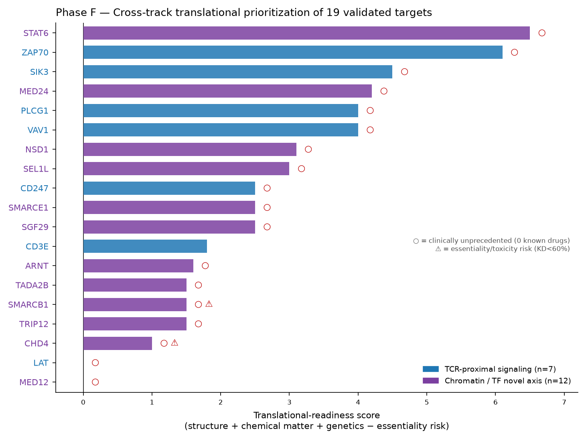

# CD4⁺ T-Cell Regulator Target Dossiers — Phase F

**Project:** Genome-scale CRISPRi Perturb-seq discovery of novel druggable regulators of CD4⁺ T-cell programs (Marson–Pritchard atlas; bioRxiv 2025.12.23.696273).
**Scope:** Translational dossiers for the **19 targets validated at single-cell resolution in Phase E** — 7 TCR-proximal signaling components (mechanistic anchors) and 12 novel chromatin/transcriptional-regulatory targets (the discovery axis).

## Executive summary

All 19 targets passed Phase E single-cell validation: on-target knockdown >15% **and** downstream transcriptional concordance (Pearson r) >0.30 in every adequately-powered donor (up to 4 donors, Stim8hr). This dossier layer adds the **translational assessment** — structural tractability (AlphaFold + experimental PDB), chemical matter (ChEMBL), modality tractability (Open Targets), clinical precedent, and human-genetic support (immune-disease GWAS) — and ranks the set by translational readiness.

**Headline findings:**
- **18 of 19 targets are clinically unprecedented** — only CD3E (the anti-CD3 antibody class) carries approved/clinical-stage drugs against the target in Open Targets. Every one of the 12 novel-axis targets has **zero** known drugs.
- **Top translational opportunities:** **STAT6** (55 immune-disease GWAS associations, 552 ChEMBL bioactivities, max pChEMBL 9.15, druggable-family SM tractability), **SIK3** (novel salt-inducible kinase, 809 bioactivities, crisp kinase domain), and the SAGA/Mediator co-activators **MED24 / SGF29 / TADA2B** (structurally well-ordered reader/scaffold modules, entirely drug-naive — ideal structure-based starts).
- **Strongest human genetics:** STAT6 (55), CD247 (46), SMARCE1 (37) immune-disease associations.
- **Highest essentiality/toxicity risk:** CHD4 and SMARCB1 — the two weakest knockdowns (KD 52% / 48%), consistent with core chromatin-remodeler-complex essentiality; flagged for careful therapeutic-window assessment.

## Cross-track translational-readiness ranking

Readiness score = structure quality + chemical matter + genetic support − essentiality risk (see Methods). ○ in the figure = clinically unprecedented; ⚠ = essentiality/toxicity risk.

| Rank | Gene | Axis | KD % | conc r | AF pLDDT | #PDB | SM buckets | ChEMBL acts | max pChEMBL | Known drugs | Immune GWAS | Readiness |
|---:|:---|:---|---:|---:|---:|---:|---:|---:|---:|---:|---:|---:|
| 1 | STAT6 | chr/TF | 82 | 0.57 | 77 | 7 | 3 | 552 | 9.15 | 0 (unprecedented) | 55 | 6.5 |
| 2 | ZAP70 | sig | 91 | 0.78 | 85 | 15 | 4 | 2390 | 8.10 | 0 (unprecedented) | 1 | 6.1 |
| 3 | SIK3 | sig | 87 | 0.52 | 51 | 5 | 3 | 809 | 9.34 | 0 (unprecedented) | 0 | 4.5 |
| 4 | MED24 | chr/TF | 96 | 0.80 | 84 | 10 | 1 | 0 | — | 0 (unprecedented) | 12 | 4.2 |
| 5 | PLCG1 | sig | 88 | 0.46 | 83 | 6 | 1 | 438 | 6.75 | 0 (unprecedented) | 0 | 4.0 |
| 6 | VAV1 | sig | 92 | 0.66 | 86 | 10 | 1 | 1 | 8.98 | 0 (unprecedented) | 0 | 4.0 |
| 7 | NSD1 | chr/TF | 92 | 0.65 | 45 | 4 | 2 | 147 | 6.96 | 0 (unprecedented) | 1 | 3.1 |
| 8 | SEL1L | chr/TF | 94 | 0.42 | 81 | 5 | 0 | 0 | — | 0 (unprecedented) | 0 | 3.0 |
| 9 | CD247 | sig | 72 | 0.51 | 62 | 38 | 1 | 0 | — | 0 (unprecedented) | 46 | 2.5 |
| 10 | SMARCE1 | chr/TF | 88 | 0.74 | 70 | 9 | 1 | 8 | 6.95 | 0 (unprecedented) | 37 | 2.5 |
| 11 | SGF29 | chr/TF | 94 | 0.69 | 92 | 8 | 1 | 1 | — | 0 (unprecedented) | 5 | 2.5 |
| 12 | CD3E | sig | 96 | 0.85 | 73 | 44 | 2 | 0 | — | 22 | 3 | 1.8 |
| 13 | ARNT | chr/TF | 89 | 0.69 | 56 | 46 | 2 | 25 | — | 0 (unprecedented) | 1 | 1.6 |
| 14 | TADA2B | chr/TF | 92 | 0.74 | 87 | 0 | 0 | 0 | — | 0 (unprecedented) | 0 | 1.5 |
| 15 | SMARCB1 | chr/TF | 48 | 0.59 | 81 | 18 | 1 | 8 | 8.03 | 0 (unprecedented) | 0 | 1.5 |
| 16 | TRIP12 | chr/TF | 84 | 0.70 | 67 | 5 | 1 | 0 | — | 0 (unprecedented) | 0 | 1.5 |
| 17 | CHD4 | chr/TF | 52 | 0.38 | 65 | 12 | 1 | 270 | 8.52 | 0 (unprecedented) | 0 | 1.0 |
| 18 | LAT | sig | 85 | 0.67 | 59 | 0 | 0 | 2 | — | 0 (unprecedented) | 0 | 0.0 |
| 19 | MED12 | chr/TF | 85 | 0.76 | 65 | 3 | 0 | 6 | 6.89 | 0 (unprecedented) | 0 | 0.0 |

*Axis: sig = TCR-proximal signaling; chr/TF = chromatin/transcription-factor novel axis. KD = mean on-target knockdown across powered donors. conc r = mean downstream concordance. SM buckets = Open Targets small-molecule tractability buckets satisfied. Known drugs = Open Targets clinical/approved candidates against the target.*

## Figures

## Methods

**Validation basis.** Targets entered Phase F only after passing Phase E single-cell validation across up to 4 donors (Stim8hr; on-target KD >15% AND downstream pseudobulk concordance Pearson r >0.30 in every adequately-powered donor). Knockdown and concordance values quoted per target are the Phase E donor means.

**Structural tractability.** AlphaFold DB predicted models (canonical GDM monomer, model v6) were retrieved for all 19 UniProt accessions; per-residue pLDDT was parsed from the model B-factor column, and confident folded domains defined as contiguous runs ≥30 residues with pLDDT ≥70. Experimental structure coverage is the RCSB PDB match count for each UniProt accession.

**Chemical matter & clinical status.** ChEMBL bioactivity counts, maximum pChEMBL, and sub-µM compound counts were pulled per ChEMBL target (single-protein, human; max pChEMBL is over a 200-activity sample and is a representative ceiling). Modality tractability buckets (small-molecule SM, antibody AB, protein-degradation PR) and known-drug/clinical-candidate counts are from Open Targets (`drugAndClinicalCandidates`).

**Human genetics.** Immune-disease GWAS association counts and maximum −log₁₀P are from the project scorecard (Phase B/C genetics layer).

**Readiness score (figure + ranking table).** A transparent heuristic: structure (mean pLDDT ≥80 → +1.5; longest confident domain ≥150 aa → +1.0; ≥5 PDB structures → +0.5) + chemical matter (≥2 SM buckets → +1.0; ≥100 bioactivities → +1.0; max pChEMBL ≥8 → +1.0) + genetics (min(GWAS/20, 1) × 2.0) − essentiality risk (KD <60% → −1.5). It is a prioritization aid, not a hard cutoff.

**Caveats.** Biological-mechanism narratives draw on established molecular immunology and are not re-derived from the screen. AlphaFold pLDDT reflects model confidence, not experimentally verified druggable-pocket geometry; disordered scaffolds may still be targetable via PPI-disruption or degrader modalities. CHD4 and SMARCB1 carry underpowered/weak-KD flags — their validations are consistent but their essentiality raises therapeutic-window concerns. All structure files (AlphaFold models + representative experimental PDBs) are saved as artifacts and render in the interactive Mol* viewer.

---

# Track A — TCR-proximal signaling targets (n=7)

These seven components (LAT scaffold, PLCγ1, CD3ζ/CD247, CD3ε, ZAP-70, VAV1, plus the novel kinase SIK3) form the **mechanistic-anchor set**: six are well-characterized TCR-proximal signaling nodes (six of the seven Phase D/E flagship targets) whose recovery validates that the discovery pipeline finds bona fide biology, and one — **SIK3** — is the group's translationally novel opportunity. Where drugs already exist, they do so here (the anti-CD3ε antibody class); most of the signaling machinery is otherwise adaptor/scaffold biology that is genetically important but chemically hard.

### LAT — Linker for activation of T-cells family member 1  *(readiness rank #18 of 19)*
**IDs:** UniProt `O43561` · Ensembl `ENSG00000213658` · axis: TCR-proximal signaling · class: SINGLE PROTEIN

**Phase E verdict:** on-target KD **85%**, downstream concordance **r=0.67**, powered in **4/4** donor(s) — **VALIDATED**.

**Biological role.** Linker for activation of T cells — the central transmembrane scaffold of the TCR signalosome. Upon TCR engagement, ZAP-70 phosphorylates LAT tyrosines, nucleating a complex that recruits PLCγ1, GRB2/SOS, and GADS/SLP-76 to propagate calcium, Ras–ERK, and NF-κB signaling. Its knockdown collapses proximal TCR signal transduction.

**Genetic support.** no immune-disease GWAS association recorded in the scorecard.

**Structural tractability.** AlphaFold mean pLDDT **59** (17% of residues ≥70), no confident folded domain; **0** experimental PDB structure(s). An intrinsically disordered single-pass membrane adaptor: only ~17% of residues exceed pLDDT 70 and no confident folded domain is resolved. Function is carried by linear phosphotyrosine motifs, not a globular fold — it is not a classical small-molecule pocket target.

**Chemical matter.** 2 ChEMBL bioactivities, no potency-annotated compounds, 0 sub-µM compound(s). Tractability buckets: SM=0 (none), AB=4, PR=3.

**Clinical landscape.** **zero** known drugs against the target (Open Targets) — clinically unprecedented.

**Therapeutic hypothesis.** Suppress-inflammation via dampened TCR signal amplification. LAT itself is a scaffold with no enzymatic pocket; the tractable route is disruption of a specific phospho-motif protein–protein interaction (peptidomimetic or molecular glue) rather than an orthosteric inhibitor.

**Development risk.** Scaffold with no druggable pocket and no antibody-accessible ectodomain of note; PPI-disruption is technically hard and LAT is broadly required for T-cell activation, raising on-target immunosuppression breadth.

---
### PLCG1 — 1-phosphatidylinositol 4,5-bisphosphate phosphodiesterase gamma-1  *(readiness rank #5 of 19)*
**IDs:** UniProt `P19174` · Ensembl `ENSG00000124181` · axis: TCR-proximal signaling · class: SINGLE PROTEIN

**Phase E verdict:** on-target KD **88%**, downstream concordance **r=0.46**, powered in **4/4** donor(s) — **VALIDATED**.

**Biological role.** Phospholipase C-γ1 — the effector enzyme downstream of LAT that hydrolyzes PIP2 to IP3 and DAG, driving the calcium/NFAT and PKC/NF-κB arms of TCR signaling. A rate-limiting node converting proximal TCR engagement into transcriptional output.

**Genetic support.** no immune-disease GWAS association recorded in the scorecard.

**Structural tractability.** AlphaFold mean pLDDT **83** (82% of residues ≥70), longest confident domain 265 aa (residues 949–1213, pLDDT 95); **6** experimental PDB structure(s) (e.g. 1HSQ, 2HSP, 4EY0). A large multidomain enzyme (1,290 aa) with a well-ordered catalytic core (confident domain ~949–1213, pLDDT ~95) plus regulatory SH2/SH3/PH modules; 82% of residues are confident. Six experimental structures anchor structure-based design of the catalytic and regulatory interfaces.

**Chemical matter.** 438 ChEMBL bioactivities, max pChEMBL 6.75, 2 sub-µM compound(s). Tractability buckets: SM=1 (High-Quality Ligand), AB=2, PR=4.

**Clinical landscape.** **zero** known drugs against the target (Open Targets) — clinically unprecedented.

**Therapeutic hypothesis.** Suppress-inflammation by throttling TCR→calcium/DAG flux. A catalytic-site or allosteric small-molecule inhibitor is plausible given the ordered enzymatic core; the SH2 domains offer an alternative interaction-blocking surface.

**Development risk.** PLCγ1 is essential for many receptor pathways beyond the TCR; systemic inhibition risks broad signaling toxicity. Gain-of-function PLCG1 variants in lymphoma also complicate the therapeutic-direction framing.

---
### CD247 — T-cell surface glycoprotein CD3 zeta chain  *(readiness rank #9 of 19)*
**IDs:** UniProt `P20963` · Ensembl `ENSG00000198821` · axis: TCR-proximal signaling · class: (inferred:protein_coding)

**Phase E verdict:** on-target KD **72%**, downstream concordance **r=0.51**, powered in **4/4** donor(s) — **VALIDATED**.

**Biological role.** CD3ζ (TCR ζ-chain) — the ITAM-bearing signaling subunit of the TCR–CD3 complex. Its three ITAMs are the primary ZAP-70 docking sites after Lck phosphorylation; ζ-chain dosage tunes activation threshold and is a known determinant of T-cell hyporesponsiveness.

**Genetic support.** 46 immune-disease GWAS association(s) (max −log₁₀P 24.7; asthma-allergy(35); other-autoimmune(9); RA(2)) — strong human-genetic support.

**Structural tractability.** AlphaFold mean pLDDT **62** (25% of residues ≥70), no confident folded domain; **38** experimental PDB structure(s) (e.g. 1TCE, 1YGR, 2HAC). A short (164 aa) largely disordered chain (25% confident) — the ITAM signaling tails are unstructured by design. Notably it maps to 38 experimental PDB entries, almost all as ITAM peptides or ζζ transmembrane assemblies in complex, reflecting its role as an interaction module rather than an enzyme.

**Chemical matter.** 0 ChEMBL bioactivities, no potency-annotated compounds, None sub-µM compound(s). Tractability buckets: SM=1 (Structure with Ligand), AB=3, PR=2.

**Clinical landscape.** **zero** known drugs against the target (Open Targets) — clinically unprecedented.

**Therapeutic hypothesis.** Suppress-inflammation by lowering TCR signaling gain. As a disordered ITAM chain, CD247 is not an orthosteric small-molecule target; modulation would work through the assembled receptor (antibody/biologic against the complex) or the transmembrane ζζ interface.

**Development risk.** No independent folded pocket; hard to drug selectively without hitting the whole TCR complex. Strong human genetics (46 immune-disease associations) makes it a compelling biology node even where direct drugging is difficult.

---
### CD3E — T-cell surface glycoprotein CD3 epsilon chain  *(readiness rank #12 of 19)*
**IDs:** UniProt `P07766` · Ensembl `ENSG00000198851` · axis: TCR-proximal signaling · class: SINGLE PROTEIN

**Phase E verdict:** on-target KD **96%**, downstream concordance **r=0.85**, powered in **4/4** donor(s) — **VALIDATED**.

**Biological role.** CD3ε — invariant signaling subunit of the TCR–CD3 complex and the single most clinically validated node in this set. Anti-CD3ε antibodies (teplizumab, otelixizumab, muromonab) are approved or late-stage across transplant rejection, T1D prevention, and autoimmunity.

**Genetic support.** 3 immune-disease GWAS association(s) (max −log₁₀P 7.3; IBD(3)) — limited human-genetic support.

**Structural tractability.** AlphaFold mean pLDDT **73** (57% of residues ≥70), longest confident domain 82 aa (residues 72–153, pLDDT 89); **44** experimental PDB structure(s) (e.g. 1A81, 1SY6, 1XIW). A 207-aa chain with a confident extracellular Ig-like domain (~72–153, pLDDT ~89) and disordered cytoplasmic ITAM tail; 44 experimental structures including antibody complexes define the epitope landscape for biologics.

**Chemical matter.** 0 ChEMBL bioactivities, no potency-annotated compounds, 0 sub-µM compound(s). Tractability buckets: SM=2 (Structure with Ligand, Med-Quality Pocket), AB=5, PR=2.

**Clinical landscape.** 22 clinical/approved candidate(s) against the target — e.g. OTELIXIZUMAB (PHASE_3); ERTUMAXOMAB (PHASE_2); BLINATUMOMAB (APPROVAL); TEPLIZUMAB (APPROVAL).

**Therapeutic hypothesis.** Suppress-inflammation / immune modulation via the established anti-CD3 antibody mechanism (partial agonism, Treg induction, transient T-cell modulation). This target validates the platform: a Phase-E-confirmed hit that is already a marketed drug class.

**Development risk.** Well-trodden: cytokine-release and immunosuppression are known class effects, now managed by dosing and humanization. Little novelty — its value here is as a positive control confirming the discovery pipeline recovers bona fide drug targets.

---
### ZAP70 — Tyrosine-protein kinase ZAP-70  *(readiness rank #2 of 19)*
**IDs:** UniProt `P43403` · Ensembl `ENSG00000115085` · axis: TCR-proximal signaling · class: SINGLE PROTEIN

**Phase E verdict:** on-target KD **91%**, downstream concordance **r=0.78**, powered in **3/3** donor(s) — **VALIDATED**.

**Biological role.** ζ-chain-associated protein kinase 70 — the Syk-family tyrosine kinase that binds phosphorylated CD3ζ ITAMs and phosphorylates LAT/SLP-76 to launch downstream signaling. Loss-of-function causes human SCID; it is the archetypal proximal TCR kinase.

**Genetic support.** 1 immune-disease GWAS association(s) (max −log₁₀P 7.7; other-autoimmune(1)) — limited human-genetic support.

**Structural tractability.** AlphaFold mean pLDDT **85** (85% of residues ≥70), longest confident domain 254 aa (residues 3–256, pLDDT 92); **15** experimental PDB structure(s) (e.g. 1FBV, 1M61, 1U59). Well-folded 619-aa kinase: tandem SH2 domains plus a confident C-terminal kinase domain (confident region ~3–256 among 4 domains, 85% confident overall). 15 experimental structures including inhibitor complexes make it fully SBDD-ready.

**Chemical matter.** 2390 ChEMBL bioactivities, max pChEMBL 8.10, 20 sub-µM compound(s). Tractability buckets: SM=4 (Structure with Ligand, High-Quality Ligand, High-Quality Pocket, Druggable Family), AB=2, PR=4.

**Clinical landscape.** **zero** known drugs against the target (Open Targets) — clinically unprecedented.

**Therapeutic hypothesis.** Suppress-inflammation via ATP-competitive or allosteric kinase inhibition — the most chemically mature route in this set (2,390 ChEMBL bioactivities, max pChEMBL 8.1, 20 sub-µM compounds). A large existing chemical space de-risks hit-finding.

**Development risk.** Selectivity vs. the related kinase SYK and broader kinome is the central challenge; ZAP-70 inhibition is broadly immunosuppressive. Chemical precedent exists but no approved ZAP-70-selective drug, signaling a real selectivity hurdle.

---
### VAV1 — Proto-oncogene vav  *(readiness rank #6 of 19)*
**IDs:** UniProt `P15498` · Ensembl `ENSG00000141968` · axis: TCR-proximal signaling · class: SINGLE PROTEIN

**Phase E verdict:** on-target KD **92%**, downstream concordance **r=0.66**, powered in **3/3** donor(s) — **VALIDATED**.

**Biological role.** Guanine-nucleotide exchange factor for Rho-family GTPases, activated downstream of the LAT signalosome. VAV1 couples TCR signaling to cytoskeletal remodeling, integrin activation, and transcriptional programs; a recurrent site of autoimmune-associated variation.

**Genetic support.** no immune-disease GWAS association recorded in the scorecard.

**Structural tractability.** AlphaFold mean pLDDT **86** (89% of residues ≥70), longest confident domain 271 aa (residues 189–459, pLDDT 93); **10** experimental PDB structure(s) (e.g. 2CRH, 2LCT, 2MC1). An 845-aa multidomain protein (86% confident) with a large ordered core (confident region ~189–459 among 6 domains) spanning the DH-PH-C1 catalytic cassette and SH2/SH3 modules; 10 experimental structures.

**Chemical matter.** 1 ChEMBL bioactivity, max pChEMBL 8.98, 1 sub-µM compound(s). Tractability buckets: SM=1 (Structure with Ligand), AB=1, PR=3.

**Clinical landscape.** **zero** known drugs against the target (Open Targets) — clinically unprecedented.

**Therapeutic hypothesis.** Suppress-inflammation by blocking TCR-driven GEF activity or its autoinhibition release. The ordered DH catalytic domain and regulatory interfaces are candidate small-molecule sites, though GEFs are historically challenging.

**Development risk.** GEF catalytic sites are shallow and PPI-like; chemical matter is essentially absent (1 bioactivity). Attractive biology, immature chemistry — an early-stage small-molecule or degrader concept.

---
### SIK3 — Serine/threonine-protein kinase SIK3  *(readiness rank #3 of 19)*
**IDs:** UniProt `Q9Y2K2` · Ensembl `ENSG00000160584` · axis: TCR-proximal signaling · class: SINGLE PROTEIN

**Phase E verdict:** on-target KD **87%**, downstream concordance **r=0.52**, powered in **3/3** donor(s) — **VALIDATED**.

**Biological role.** Salt-inducible kinase 3 — an AMPK-family serine/threonine kinase that phosphorylates CRTC and class-IIa HDAC substrates to control inflammatory and metabolic transcription. In myeloid and T cells the SIK axis governs the pro- vs. anti-inflammatory cytokine balance; SIK inhibition reprograms macrophages toward a regulatory state. The one novel kinase in the signaling set.

**Genetic support.** no immune-disease GWAS association recorded in the scorecard.

**Structural tractability.** AlphaFold mean pLDDT **51** (26% of residues ≥70), longest confident domain 277 aa (residues 60–336, pLDDT 94); **5** experimental PDB structure(s) (e.g. 8OKU, 8R4O, 8R4Q). A 1,321-aa kinase with a compact, very-high-confidence catalytic domain (confident region ~60–336, pLDDT ~94) embedded in a long disordered regulatory tail — the classic 'fold the kinase domain, ignore the tail' profile. 5 experimental structures, including recent ligand-bound SIK3 kinase-domain entries (8R4O series), directly support SBDD.

**Chemical matter.** 809 ChEMBL bioactivities, max pChEMBL 9.34, 18 sub-µM compound(s). Tractability buckets: SM=3 (Structure with Ligand, High-Quality Ligand, Druggable Family), AB=0, PR=4.

**Clinical landscape.** **zero** known drugs against the target (Open Targets) — clinically unprecedented.

**Therapeutic hypothesis.** Suppress-inflammation through ATP-competitive kinase inhibition. SIK3 is the most translationally novel opportunity in Track A: rich chemical matter (809 ChEMBL bioactivities, max pChEMBL 9.34, 18 sub-µM compounds), a druggable-family SM bucket with structures-with-ligand, yet zero approved drugs against the target — a genuine novel-druggable kinase.

**Development risk.** Pan-SIK (SIK1/2/3) selectivity and on-target metabolic effects need managing; the SIK inhibitor field is young. But the combination of a crisp kinase-domain fold, existing ligands, and clean clinical whitespace is the strongest small-molecule case among the novel targets.

---

# Track B — Chromatin & transcriptional-regulatory targets (n=12)

This is the **novel discovery axis and the project's central claim**: twelve chromatin/transcriptional regulators — SAGA/Mediator co-activators (SGF29, MED24, MED12, TADA2B), remodeler subunits (SMARCE1, SMARCB1, CHD4, NSD1), and transcription/proteostasis factors (STAT6, TRIP12, ARNT, SEL1L) — that are genetically and functionally validated regulators of CD4⁺ T-cell programs yet carry **essentially no existing therapeutic programs** (every one has zero Open Targets known drugs). The standouts span the tractability spectrum: **STAT6** (top-ranked — unmatched genetics + chemistry), the structurally crisp drug-naive readers **SGF29 / TADA2B / MED24**, the catalytic-domain-bearing enzymes **NSD1 / CHD4 / TRIP12**, and the essentiality-flagged pair **CHD4 / SMARCB1**.

### SMARCE1 — SWI/SNF-related matrix-associated actin-dependent regulator of chromatin subfamily E member 1  *(readiness rank #10 of 19)*
**IDs:** UniProt `Q969G3` · Ensembl `ENSG00000073584` · axis: chromatin / transcriptional regulation · class: SINGLE PROTEIN

**Phase E verdict:** on-target KD **88%**, downstream concordance **r=0.74**, powered in **3/3** donor(s) — **VALIDATED**.

**Biological role.** BAF57 — a core subunit of the SWI/SNF (BAF) ATP-dependent chromatin-remodeling complex. SMARCE1 stabilizes BAF assembly and directs enhancer accessibility governing T-cell lineage and activation programs. Strong human genetics: 37 immune-disease associations.

**Genetic support.** 37 immune-disease GWAS association(s) (max −log₁₀P 67.5; asthma-allergy(32); T1D(3); IBD(2)) — strong human-genetic support.

**Structural tractability.** AlphaFold mean pLDDT **70** (56% of residues ≥70), longest confident domain 106 aa (residues 58–163, pLDDT 91); **9** experimental PDB structure(s) (e.g. 6LTH, 6LTJ, 7CYU). A 411-aa subunit with an ordered HMG-box/coiled-coil core (56% confident; top domains ~58–163 pLDDT ~91) and flexible termini; 9 experimental structures within BAF sub-assemblies.

**Chemical matter.** 8 ChEMBL bioactivities, max pChEMBL 6.95, 2 sub-µM compound(s). Tractability buckets: SM=1 (Structure with Ligand), AB=0, PR=3.

**Clinical landscape.** **zero** known drugs against the target (Open Targets) — clinically unprecedented.

**Therapeutic hypothesis.** Suppress-inflammation by destabilizing a specific BAF subcomplex interaction. As a structural subunit, the tractable route is PPI disruption or targeted degradation rather than an enzymatic inhibitor.

**Development risk.** BAF is broadly essential; subunit-selective targeting must exploit context-specific dependencies to open a therapeutic window. Drug-naive (0 known drugs), strong genetics.

---
### SGF29 — SAGA-associated factor 29  *(readiness rank #11 of 19)*
**IDs:** UniProt `Q96ES7` · Ensembl `ENSG00000176476` · axis: chromatin / transcriptional regulation · class: SINGLE PROTEIN

**Phase E verdict:** on-target KD **94%**, downstream concordance **r=0.69**, powered in **4/4** donor(s) — **VALIDATED**.

**Biological role.** SAGA-complex subunit 29 — a tandem-Tudor reader that binds H3K4me2/3 to recruit the SAGA histone-acetyltransferase (GCN5/KAT2A) module to active promoters, coupling histone-methyl reading to acetylation. A node in the SAGA co-activator axis controlling activation-induced transcription.

**Genetic support.** 5 immune-disease GWAS association(s) (max −log₁₀P 9.5; asthma-allergy(3); IBD(2)) — moderate human-genetic support.

**Structural tractability.** AlphaFold mean pLDDT **92** (92% of residues ≥70), longest confident domain 99 aa (residues 4–102, pLDDT 94); **8** experimental PDB structure(s) (e.g. 3LX7, 3ME9, 3MEA). A compact, very-high-confidence protein (293 aa, 92% confident) resolved as three discrete ordered domains (4–102, 114–196, 201–288; pLDDT 94–97), including the tandem-Tudor reader; 8 experimental structures including methyl-lysine-bound reader domains — an outstanding SBDD substrate.

**Chemical matter.** 1 ChEMBL bioactivity, no potency-annotated compounds, 0 sub-µM compound(s). Tractability buckets: SM=1 (High-Quality Pocket), AB=0, PR=2.

**Clinical landscape.** **zero** known drugs against the target (Open Targets) — clinically unprecedented.

**Therapeutic hypothesis.** Suppress-inflammation by blocking the SGF29 Tudor–H3K4me3 interaction with a methyl-mimetic small molecule, detaching SAGA-HAT from active chromatin. Reader-domain antagonism is a validated epigenetic modality (cf. BET bromodomains).

**Development risk.** Drug-naive (1 bioactivity, 0 known drugs) but the reader pocket is precedented and crisply folded. Chief risk is achieving cellular selectivity over other Tudor readers; overall one of the cleanest structure-based starts in the set.

---
### MED24 — Mediator of RNA polymerase II transcription subunit 24  *(readiness rank #4 of 19)*
**IDs:** UniProt `O75448` · Ensembl `ENSG00000008838` · axis: chromatin / transcriptional regulation · class: (inferred:protein_coding)

**Phase E verdict:** on-target KD **96%**, downstream concordance **r=0.80**, powered in **4/4** donor(s) — **VALIDATED**.

**Biological role.** Mediator complex subunit 24 — part of the Mediator middle/tail module that bridges enhancer-bound transcription factors to RNA Pol II. MED24 helps transmit signal-dependent TF activity (including nuclear-receptor and activation programs) into transcription in CD4⁺ T cells. 12 immune-disease associations.

**Genetic support.** 12 immune-disease GWAS association(s) (max −log₁₀P 29.5; asthma-allergy(12)) — moderate human-genetic support.

**Structural tractability.** AlphaFold mean pLDDT **84** (85% of residues ≥70), longest confident domain 188 aa (residues 41–228, pLDDT 90); **10** experimental PDB structure(s) (e.g. 7EMF, 7ENA, 7ENC). A well-ordered 989-aa subunit (85% confident; top domain ~41–228 pLDDT ~90) with 10 experimental structures within cryo-EM Mediator assemblies defining its inter-subunit interfaces.

**Chemical matter.** 0 ChEMBL bioactivities, no potency-annotated compounds, None sub-µM compound(s). Tractability buckets: SM=1 (Structure with Ligand), AB=0, PR=2.

**Clinical landscape.** **zero** known drugs against the target (Open Targets) — clinically unprecedented.

**Therapeutic hypothesis.** Suppress-inflammation by disrupting a specific Mediator TF-docking interaction. Best pursued as PPI disruption or degradation given its role as a bridging scaffold; small-molecule interface inhibition is conceivable at defined contact surfaces.

**Development risk.** Mediator is broadly essential for transcription; selectivity for signal-dependent (vs. housekeeping) Mediator function is the key challenge. Entirely drug-naive.

---
### MED12 — Mediator of RNA polymerase II transcription subunit 12  *(readiness rank #19 of 19)*
**IDs:** UniProt `Q93074` · Ensembl `ENSG00000184634` · axis: chromatin / transcriptional regulation · class: SINGLE PROTEIN

**Phase E verdict:** on-target KD **85%**, downstream concordance **r=0.76**, powered in **4/4** donor(s) — **VALIDATED**.

**Biological role.** Mediator subunit 12 — component of the Mediator kinase (CDK8) module that gates Pol II activity and represses/activates signal-responsive gene sets. MED12 tunes the transcriptional response to T-cell activation and is a recurrent cancer-associated subunit.

**Genetic support.** no immune-disease GWAS association recorded in the scorecard.

**Structural tractability.** AlphaFold mean pLDDT **65** (53% of residues ≥70), longest confident domain 131 aa (residues 825–955, pLDDT 90); **3** experimental PDB structure(s) (e.g. 8TQ2, 8TQC, 8TQW). A very large 2,177-aa subunit, mostly disordered (53% confident) with scattered ordered modules (top ~825–955 pLDDT ~91); 3 experimental structures within CDK8-module assemblies.

**Chemical matter.** 6 ChEMBL bioactivities, max pChEMBL 6.89, 1 sub-µM compound(s). Tractability buckets: SM=0 (none), AB=0, PR=2.

**Clinical landscape.** **zero** known drugs against the target (Open Targets) — clinically unprecedented.

**Therapeutic hypothesis.** Suppress-inflammation indirectly by modulating the CDK8-kinase module it scaffolds. MED12 has no small-molecule or antibody (SM/AB) tractability bucket — only protein-degradation (PR)-modality entries — so a targeted-degrader (PROTAC/molecular-glue) strategy, or targeting the associated CDK8 kinase, is the realistic route.

**Development risk.** No SM/AB pocket, large disordered scaffold, core-essential complex — among the least conventionally tractable. Degrader logic is the main hope; drug-naive.

---
### TADA2B — Transcriptional adapter 2-beta  *(readiness rank #14 of 19)*
**IDs:** UniProt `Q86TJ2` · Ensembl `ENSG00000173011` · axis: chromatin / transcriptional regulation · class: (inferred:protein_coding)

**Phase E verdict:** on-target KD **92%**, downstream concordance **r=0.74**, powered in **4/4** donor(s) — **VALIDATED**.

**Biological role.** Transcriptional adaptor 2B — the ADA2B subunit that partners the GCN5/PCAF histone-acetyltransferase within the ATAC co-activator complex, stimulating HAT activity and directing acetylation at active regulatory elements controlling activation-induced transcription.

**Genetic support.** no immune-disease GWAS association recorded in the scorecard.

**Structural tractability.** AlphaFold mean pLDDT **87** (88% of residues ≥70), longest confident domain 126 aa (residues 5–130, pLDDT 92); **0** experimental PDB structure(s). A compact, well-ordered 420-aa protein (87% confident; top domains ~5–130 pLDDT ~92) containing ZZ and SANT domains; no experimental PDB entry (AlphaFold-only), but the high-confidence fold supports model-based design.

**Chemical matter.** 0 ChEMBL bioactivities, no potency-annotated compounds, None sub-µM compound(s). Tractability buckets: SM=0 (none), AB=0, PR=2.

**Clinical landscape.** **zero** known drugs against the target (Open Targets) — clinically unprecedented.

**Therapeutic hypothesis.** Suppress-inflammation by disrupting the TADA2B–GCN5 activating interaction or its ZZ/SANT interaction surfaces. Like MED12/TADA2B carries no small-molecule or antibody (SM/AB) tractability bucket (PR-modality only), pointing toward a targeted-degrader or PPI-disruption approach on the well-folded module.

**Development risk.** AlphaFold-only (no crystal structure yet) and no SM/AB bucket; degrader or interface strategy on a crisp fold. Drug-naive, but structurally the most orderly of the SM/AB-untractable subunits.

---
### NSD1 — Histone-lysine N-methyltransferase, H3 lysine-36 specific  *(readiness rank #7 of 19)*
**IDs:** UniProt `Q96L73` · Ensembl `ENSG00000165671` · axis: chromatin / transcriptional regulation · class: SINGLE PROTEIN

**Phase E verdict:** on-target KD **92%**, downstream concordance **r=0.65**, powered in **3/3** donor(s) — **VALIDATED**.

**Biological role.** Nuclear receptor-binding SET-domain protein 1 — a histone H3K36 methyltransferase that deposits an activating chromatin mark shaping enhancer/gene-body transcription during T-cell activation. NSD-family methyltransferases are established oncology epigenetic targets.

**Genetic support.** 1 immune-disease GWAS association(s) (max −log₁₀P 10.0; asthma-allergy(1)) — limited human-genetic support.

**Structural tractability.** AlphaFold mean pLDDT **45** (26% of residues ≥70), longest confident domain 190 aa (residues 1631–1820, pLDDT 90); **4** experimental PDB structure(s) (e.g. 3OOI, 6KQP, 6KQQ). A very large 2,696-aa enzyme, predominantly disordered (26% confident) but with a discrete, confident catalytic module: the SET methyltransferase domain maps to the top confident domain (~1631–1820, pLDDT ~90). 4 experimental structures anchor the catalytic pocket.

**Chemical matter.** 147 ChEMBL bioactivities, max pChEMBL 6.96, 10 sub-µM compound(s). Tractability buckets: SM=2 (Structure with Ligand, High-Quality Ligand), AB=1, PR=4.

**Clinical landscape.** **zero** known drugs against the target (Open Targets) — clinically unprecedented.

**Therapeutic hypothesis.** Suppress-inflammation via SAM-competitive or substrate-competitive inhibition of the SET domain — the same catalytic-pocket logic that yielded NSD2/EZH2 inhibitors. 147 ChEMBL bioactivities give a modest chemical starting point.

**Development risk.** Only the SET domain is druggable within a huge scaffold; whole-protein selectivity and isoform (NSD1/2/3) discrimination are challenges. Drug-naive against NSD1 specifically but chemically precedented family.

---
### CHD4 — Chromodomain-helicase-DNA-binding protein 4  *(readiness rank #17 of 19)*
**IDs:** UniProt `Q14839` · Ensembl `ENSG00000111642` · axis: chromatin / transcriptional regulation · class: SINGLE PROTEIN

**Phase E verdict:** on-target KD **52%**, downstream concordance **r=0.38**, powered in **4/4** donor(s) — **VALIDATED**.

**Biological role.** Chromodomain-helicase-DNA-binding protein 4 — the ATPase engine of the NuRD repressive remodeling complex, coupling histone deacetylation to nucleosome repositioning. CHD4 enforces gene-silencing programs that restrain aberrant T-cell activation.

**Genetic support.** no immune-disease GWAS association recorded in the scorecard.

**Structural tractability.** AlphaFold mean pLDDT **65** (54% of residues ≥70), longest confident domain 126 aa (residues 703–828, pLDDT 90); **12** experimental PDB structure(s) (e.g. 1MM2, 1MM3, 2EE1). A large 1,912-aa remodeler (54% confident) with confident tandem chromodomains and an ATPase module among 13 domains (top ~703–828 pLDDT ~90); 12 experimental structures cover chromo/PHD reader and ATPase regions.

**Chemical matter.** 270 ChEMBL bioactivities, max pChEMBL 8.52, 1 sub-µM compound(s). Tractability buckets: SM=1 (Structure with Ligand), AB=0, PR=4.

**Clinical landscape.** **zero** known drugs against the target (Open Targets) — clinically unprecedented.

**Therapeutic hypothesis.** Suppress-inflammation by inhibiting the CHD4 ATPase or antagonizing its reader domains. 270 ChEMBL bioactivities (max pChEMBL 8.52) indicate emerging chemical matter around the ATPase/reader modules.

**Development risk.** FLAGGED: weakest knockdown in the set (KD 52%) with concordance at the r=0.38 floor — consistent with core-complex essentiality and a narrow therapeutic window. NuRD is broadly required; toxicity risk is the dominant concern.

---
### SMARCB1 — SWI/SNF-related matrix-associated actin-dependent regulator of chromatin subfamily B member 1  *(readiness rank #15 of 19)*
**IDs:** UniProt `Q12824` · Ensembl `ENSG00000099956` · axis: chromatin / transcriptional regulation · class: SINGLE PROTEIN

**Phase E verdict:** on-target KD **48%**, downstream concordance **r=0.59**, powered in **4/4** donor(s) — **VALIDATED**.

**Biological role.** SNF5/INI1 — an invariant core subunit of the SWI/SNF (BAF) remodeling complex and a classical tumor suppressor. SMARCB1 anchors BAF engagement with nucleosomes and enhancers governing lineage and activation programs.

**Genetic support.** no immune-disease GWAS association recorded in the scorecard.

**Structural tractability.** AlphaFold mean pLDDT **81** (77% of residues ≥70), longest confident domain 81 aa (residues 171–251, pLDDT 93); **18** experimental PDB structure(s) (e.g. 5AJ1, 5GJK, 5L7A). A well-ordered 385-aa subunit (77% confident; top domains ~171–251 pLDDT ~93) with 18 experimental structures — the best-characterized structural biology among the remodeler subunits here.

**Chemical matter.** 8 ChEMBL bioactivities, max pChEMBL 8.03, 2 sub-µM compound(s). Tractability buckets: SM=1 (Structure with Ligand), AB=0, PR=3.

**Clinical landscape.** **zero** known drugs against the target (Open Targets) — clinically unprecedented.

**Therapeutic hypothesis.** Suppress-inflammation by disrupting a BAF assembly interface. As a structural core subunit the route is PPI disruption or degradation; the well-defined fold and rich structural coverage aid interface mapping.

**Development risk.** FLAGGED: second-weakest knockdown (KD 48%), reflecting essentiality of a core BAF subunit and tumor-suppressor status — loss-of-function is oncogenic, so any degrader/inhibitor demands an exquisitely context-restricted window. Drug-naive.

---
### STAT6 — Signal transducer and activator of transcription 6  *(readiness rank #1 of 19)*
**IDs:** UniProt `P42226` · Ensembl `ENSG00000166888` · axis: chromatin / transcriptional regulation · class: SINGLE PROTEIN

**Phase E verdict:** on-target KD **82%**, downstream concordance **r=0.57**, powered in **4/4** donor(s) — **VALIDATED**.

**Biological role.** Signal transducer and activator of transcription 6 — the master TF of type-2 (IL-4/IL-13) immunity. STAT6 drives Th2 differentiation and the transcriptional program underlying asthma, atopic dermatitis, and allergy. The strongest human-genetic hit in the set: 55 asthma/allergy GWAS associations (max −log₁₀P ≈ 38.5).

**Genetic support.** 55 immune-disease GWAS association(s) (max −log₁₀P 38.5; asthma-allergy(55)) — strong human-genetic support.

**Structural tractability.** AlphaFold mean pLDDT **77** (71% of residues ≥70), longest confident domain 236 aa (residues 398–633, pLDDT 95); **7** experimental PDB structure(s) (e.g. 1OJ5, 4Y5U, 4Y5W). An 847-aa TF (71% confident) with a large confident DNA-binding/SH2 core (top domain ~398–633 pLDDT ~95; second ~174–302); 7 experimental structures including DNA- and phosphopeptide-bound forms defining the SH2 and DNA-binding interfaces.

**Chemical matter.** 552 ChEMBL bioactivities, max pChEMBL 9.15, 70 sub-µM compound(s). Tractability buckets: SM=3 (Structure with Ligand, High-Quality Ligand, Druggable Family), AB=0, PR=3.

**Clinical landscape.** **zero** known drugs against the target (Open Targets) — clinically unprecedented.

**Therapeutic hypothesis.** Boost-immunity direction in the screen reflects STAT6's central regulatory role; therapeutically the validated logic is STAT6 INHIBITION for type-2 inflammation. Richest chemical matter in the whole set (552 bioactivities, max pChEMBL 9.15, 70 sub-µM compounds) plus a druggable-family SM bucket — an SH2-domain or DNA-binding-interface inhibitor, or a degrader, is well-supported.

**Development risk.** Despite strong chemistry and genetics, no approved STAT6-directed drug — SH2/TF-surface inhibition is historically hard, though recent STAT-degrader and covalent approaches are encouraging. The top-ranked opportunity: unmatched genetics + chemistry + structure, clean clinical whitespace.

---
### TRIP12 — E3 ubiquitin-protein ligase TRIP12  *(readiness rank #16 of 19)*
**IDs:** UniProt `Q14669` · Ensembl `ENSG00000153827` · axis: chromatin / transcriptional regulation · class: (inferred:protein_coding)

**Phase E verdict:** on-target KD **84%**, downstream concordance **r=0.70**, powered in **4/4** donor(s) — **VALIDATED**.

**Biological role.** Thyroid-hormone-receptor-interacting protein 12 — a HECT-domain E3 ubiquitin ligase controlling protein turnover of chromatin and DNA-damage-response factors, with emerging roles in immune-cell homeostasis and TF stability.

**Genetic support.** no immune-disease GWAS association recorded in the scorecard.

**Structural tractability.** AlphaFold mean pLDDT **67** (59% of residues ≥70), longest confident domain 224 aa (residues 436–659, pLDDT 88); **5** experimental PDB structure(s) (e.g. 9BKR, 9BKS, 9GKM). A large 1,992-aa ligase (59% confident) with a confident HECT catalytic region among 12 domains (top ~436–659 pLDDT ~88); 5 experimental structures.

**Chemical matter.** 0 ChEMBL bioactivities, no potency-annotated compounds, None sub-µM compound(s). Tractability buckets: SM=1 (Structure with Ligand), AB=0, PR=2.

**Clinical landscape.** **zero** known drugs against the target (Open Targets) — clinically unprecedented.

**Therapeutic hypothesis.** Modulate inflammation by inhibiting or redirecting its E3 catalytic activity. HECT-ligase active sites (catalytic cysteine) are addressable by covalent small molecules; TRIP12 could also be harnessed as an effector for targeted degradation of other proteins.

**Development risk.** E3 ligases are emerging but historically tough targets; TRIP12 chemical matter is absent (0 bioactivities). Early-stage covalent-inhibitor or degrader-recruitment concept; drug-naive.

---
### ARNT — Aryl hydrocarbon receptor nuclear translocator  *(readiness rank #13 of 19)*
**IDs:** UniProt `P27540` · Ensembl `ENSG00000143437` · axis: chromatin / transcriptional regulation · class: SINGLE PROTEIN

**Phase E verdict:** on-target KD **89%**, downstream concordance **r=0.69**, powered in **4/4** donor(s) — **VALIDATED**.

**Biological role.** Aryl-hydrocarbon-receptor nuclear translocator (HIF-1β) — the obligate bHLH-PAS dimerization partner for AHR and HIF-α, integrating environmental (xenobiotic) and hypoxic signals into transcription. In T cells the AHR–ARNT axis shapes Th17/Treg balance and mucosal immunity.

**Genetic support.** 1 immune-disease GWAS association(s) (max −log₁₀P 11.5; asthma-allergy(1)) — limited human-genetic support.

**Structural tractability.** AlphaFold mean pLDDT **56** (34% of residues ≥70), longest confident domain 105 aa (residues 361–465, pLDDT 92); **46** experimental PDB structure(s) (e.g. 1X0O, 2A24, 2B02). A 789-aa TF (34% confident overall) with confident PAS dimerization domains (top ~361–465 pLDDT ~92); 46 experimental structures — the most PDB-covered target in the set — mapping bHLH-PAS heterodimer interfaces.

**Chemical matter.** 25 ChEMBL bioactivities, no potency-annotated compounds, 0 sub-µM compound(s). Tractability buckets: SM=2 (Structure with Ligand, High-Quality Ligand), AB=0, PR=4.

**Clinical landscape.** **zero** known drugs against the target (Open Targets) — clinically unprecedented.

**Therapeutic hypothesis.** Modulate inflammation by targeting the ARNT PAS-B dimerization pocket — a precedented ligand-binding site (cf. HIF-2α antagonists like belzutifan, which bind the paralogous PAS-B cavity). 25 bioactivities give a modest start.

**Development risk.** ARNT is a shared, broadly essential dimerization hub for AHR/HIF; selectivity for the immune-relevant complex over hypoxia signaling is the central challenge. Drug-naive against ARNT itself, but the PAS-B precedent is encouraging.

---
### SEL1L — Protein sel-1 homolog 1  *(readiness rank #8 of 19)*
**IDs:** UniProt `Q9UBV2` · Ensembl `ENSG00000071537` · axis: chromatin / transcriptional regulation · class: (inferred:protein_coding)

**Phase E verdict:** on-target KD **94%**, downstream concordance **r=0.42**, powered in **3/3** donor(s) — **VALIDATED**.

**Biological role.** SEL1L — the adaptor of the SEL1L–HRD1 ER-associated degradation (ERAD) complex, governing ER protein quality control and proteostasis. In lymphocytes ERAD capacity constrains secretory load and survival during activation; SEL1L loss impairs immune-cell homeostasis.

**Genetic support.** no immune-disease GWAS association recorded in the scorecard.

**Structural tractability.** AlphaFold mean pLDDT **81** (79% of residues ≥70), longest confident domain 370 aa (residues 355–724, pLDDT 93); **5** experimental PDB structure(s) (e.g. 8KES, 8KET, 8KEV). A well-ordered 794-aa protein (79% confident) with an extended confident TPR/Sel1-repeat solenoid (top domain ~355–724, pLDDT ~93); 5 experimental structures of the ERAD complex.

**Chemical matter.** 0 ChEMBL bioactivities, no potency-annotated compounds, None sub-µM compound(s). Tractability buckets: SM=0 (none), AB=1, PR=2.

**Clinical landscape.** **zero** known drugs against the target (Open Targets) — clinically unprecedented.

**Therapeutic hypothesis.** Modulate inflammation by tuning ERAD throughput — disrupting the SEL1L–HRD1 interaction or the substrate-recruitment solenoid. The extended repeat surface is a PPI-interface target; a degrader is an alternative.

**Development risk.** ERAD is broadly essential for proteostasis; window depends on lymphocyte-selective secretory dependence. Carries an antibody (AB) but no small-molecule bucket; largely drug-naive (0 bioactivities).

---

## Provenance

Generated in Phase F of the CD4⁺ T-cell Perturb-seq target-discovery project. Data layers: AlphaFold DB, RCSB PDB, ChEMBL, Open Targets (all via connectors), and the project's own Phase B/C scorecard and Phase E single-cell validation. Every quantitative field is traceable to the saved groundwork artifacts (`phaseF_trackA_signaling.json`, `phaseF_trackB_chromatin_tf.json`, `phaseF_master_druggability.csv`, `phaseF_plddt_profiles.json`, `phaseF_readiness_ranked.json`).
