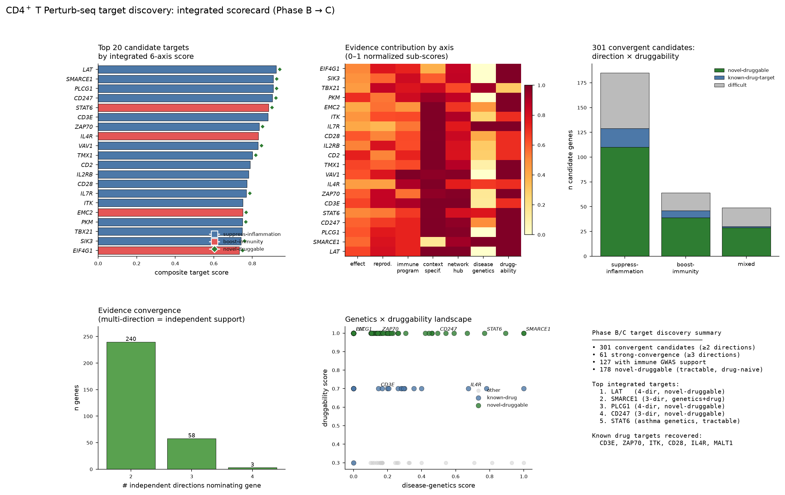
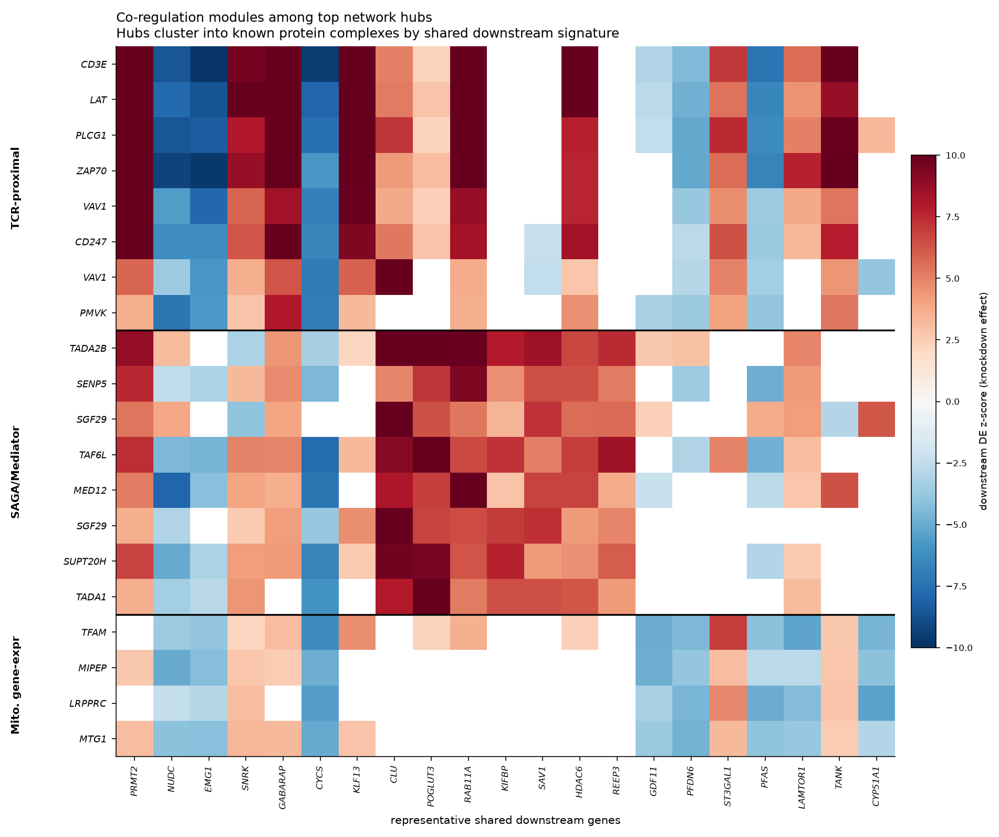
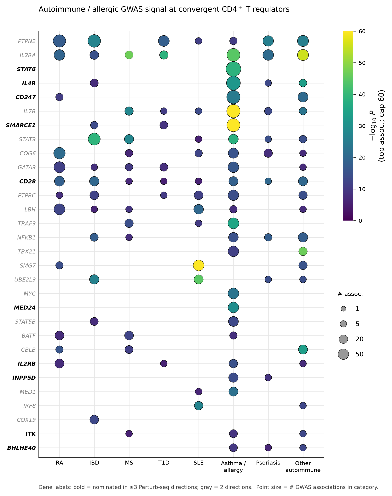
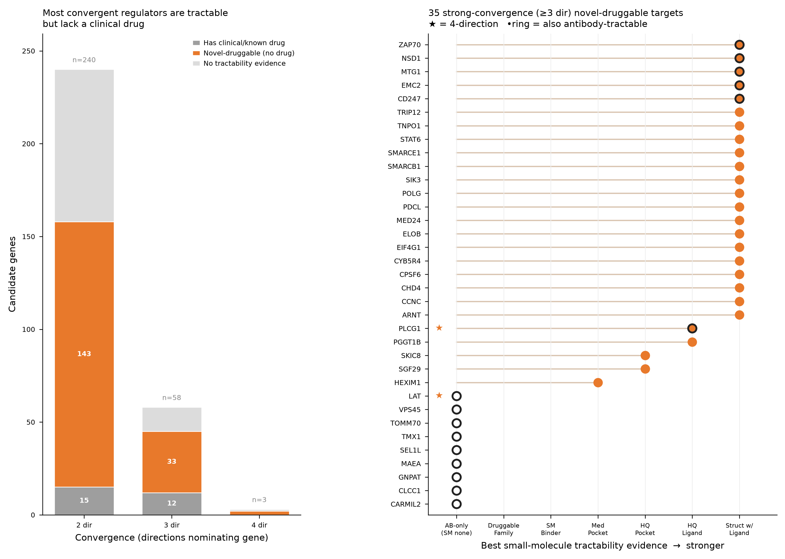

# CD4⁺ T Perturb-seq — Target Discovery Report (Phase B → C)

**Project:** Genome-scale CRISPRi Perturb-seq in primary human CD4⁺ T cells
**Analysis:** Multi-direction regulator nomination → external annotation → integrated target scorecard
**Compute:** clust1-rocm-4 · env `perturb-seq` · all data on Lustre project directory

---

## 1. Executive summary

Starting from the Phase A high-confidence set (**12,576 reproducible, on-target, off-target-clean perturbation×condition profiles** spanning **5,728 unique genes**), Phase B interrogated the genome-scale DE landscape along **four orthogonal biological directions** and annotated the convergent candidates with **two external evidence layers**:

| Direction | Question | Output |
|---|---|---|
| **D1 Cytokine regulators** | Which knockdowns shift effector cytokine output? | `cytokine_regulators.csv` |
| **D2 Polarization regulators** | Which knockdowns bias Th1/Th2/Th17/Treg/Tfh fate? | `polarization_regulators.csv` |
| **D3 Context-specific targets** | Which act only in activated (vs resting) T cells? | `context_specific_targets.csv` |
| **D4 Network hubs** | Which are master regulators by downstream reach? | `regulator_network_hubs.csv` |
| **D5 Disease genetics** | Which carry autoimmune/allergic GWAS signal? | `gwas_regulator_overlap.csv` |
| **D6 Druggability** | Which are tractable / novel / already-drugged? | `druggability_annotation.csv` |

**Phase C** integrates all six into a composite score (`TARGET_SCORECARD.csv`).

**Headline numbers**
- **301 convergent candidate genes** nominated by ≥2 independent directions; **61 by ≥3 directions**; **3 by all 4** (*LAT*, *PLCG1*, *SENP5*).
- **127/301** carry immune-disease GWAS support; **178** are **novel-druggable** (structurally/family-tractable but drug-naive).
- Therapeutic direction: **185 suppress-inflammation** (autoimmune/inflammatory indication logic), **64 boost-immunity** (immuno-oncology logic), **49 mixed**.
- **27 candidates are already drug targets** (*CD3E, ITK, MALT1, CD28, IL4R, IL2RB, STAT3, PTPRC…*) — recovered *de novo* by the CRISPRi-loss-of-function logic, validating the pipeline.

---

## 2. Top 25 integrated targets

Composite score integrates six normalized axes (effect strength, reproducibility, immune-program biology, context-specificity, network centrality, disease genetics, druggability), with a multiplicative bonus for multi-direction convergence. Full table with all sub-scores and annotations: `TARGET_SCORECARD.csv` (301 genes × 35 columns).

| Rank | Gene | Best cond. | Score | #Dir | Directions | Direction | Novelty | Immune GWAS dis. |
|---|---|---|---|---|---|---|---|---|
| 1 | *LAT* | Stim8hr | 0.925 | 4 | cytokine+polarization+context+network | suppress | novel-druggable | – |
| 2 | *SMARCE1* | Stim8hr | 0.909 | 3 | cytokine+polarization+network | suppress | novel-druggable | 37 |
| 3 | *PLCG1* | Stim8hr | 0.908 | 4 | cytokine+polarization+context+network | suppress | novel-druggable | – |
| 4 | *CD247* | Stim8hr | 0.905 | 3 | cytokine+context+network | suppress | novel-druggable | 46 |
| 5 | *STAT6* | Stim48hr | 0.885 | 3 | cytokine+polarization+context | boost | novel-druggable | 55 |
| 6 | *CD3E* | Stim8hr | 0.881 | 3 | cytokine+context+network | suppress | known-drug-target | 3 |
| 7 | *ZAP70* | Stim8hr | 0.836 | 3 | cytokine+polarization+network | suppress | novel-druggable | 1 |
| 8 | *IL4R* | Stim48hr | 0.832 | 3 | cytokine+polarization+context | boost | known-drug-target | 48 |
| 9 | *VAV1* | Stim8hr | 0.830 | 2 | cytokine+network | suppress | novel-druggable | – |
| 10 | *TMX1* | Stim8hr | 0.800 | 3 | cytokine+context+network | suppress | novel-druggable | 1 |
| 11 | *CD2* | Stim48hr | 0.790 | 3 | cytokine+polarization+context | suppress | known-drug-target | 2 |
| 12 | *IL2RB* | Stim48hr | 0.781 | 3 | cytokine+polarization+context | suppress | known-drug-target | 11 |
| 13 | *CD28* | Stim8hr | 0.773 | 3 | cytokine+context+network | suppress | known-drug-target | 29 |
| 14 | *IL7R* | Stim8hr | 0.769 | 2 | cytokine+context | suppress | novel-druggable | 44 |
| 15 | *ITK* | Stim48hr | 0.751 | 3 | cytokine+context+network | suppress | known-drug-target | 5 |
| 16 | *EMC2* | Stim48hr | 0.750 | 3 | cytokine+polarization+context | boost | novel-druggable | 3 |
| 17 | *PKM* | Stim8hr | 0.749 | 2 | cytokine+network | suppress | novel-druggable | – |
| 18 | *TBX21* | Stim8hr | 0.749 | 2 | cytokine+polarization | suppress | difficult | 16 |
| 19 | *SIK3* | Stim48hr | 0.742 | 3 | cytokine+polarization+network | suppress | novel-druggable | – |
| 20 | *EIF4G1* | Stim8hr | 0.732 | 3 | cytokine+polarization+network | boost | novel-druggable | – |
| 21 | *CBLB* | Stim8hr | 0.732 | 2 | cytokine+context | boost | novel-druggable | 11 |
| 22 | *TRIP12* | Stim8hr | 0.729 | 3 | cytokine+context+network | suppress | novel-druggable | – |
| 23 | *HEXIM1* | Stim48hr | 0.727 | 3 | cytokine+polarization+context | suppress | novel-druggable | 2 |
| 24 | *CARMIL2* | Stim8hr | 0.722 | 3 | cytokine+context+network | suppress | novel-druggable | – |
| 25 | *NSD1* | Stim48hr | 0.718 | 3 | cytokine+polarization+network | suppress | novel-druggable | 1 |

*(“#Dir” = number of independent nominating directions; “Immune GWAS dis.” = count of autoimmune/allergic disease-level associations.)*

---

## 3. Target dossiers (top 20)

Each dossier reports the measured knockdown phenotype (cytokine/polarization shift), network reach, activation-context dependence, human-genetics support, and druggability. Effect signs: ↓ = readout decreases on knockdown, ↑ = increases.

#### 1. LAT  

**4-direction** · *novel-druggable* · suppress-inflammation · module: TCR-proximal signaling  

Knockdown shifts cytokine readouts: *IL2RA* ↓(z=-14.6), *IFNG* ↓(z=-6.2), *IL10* ↓(z=-5.0), *CTLA4* ↓(z=-4.4) (Stim8hr). Polarization: →Effector (|z|=3.7). Network hub with 5445 downstream DE genes. Context: activation-induced. No common-variant disease GWAS signal (value from functional convergence). Druggability: SINGLE PROTEIN.

#### 2. SMARCE1  

**3-direction** · *novel-druggable* · suppress-inflammation  

Knockdown shifts cytokine readouts: *IL2RA* ↓(z=-8.5), *IL2RA* ↓(z=-8.2), *IL3* ↓(z=-6.6), *CTLA4* ↓(z=-6.2) (Stim8hr). Polarization: →Effector (|z|=4.5). Network hub with 3267 downstream DE genes. Context: constitutive. GWAS: 37 autoimmune/allergic disease associations (max −log₁₀P=67.5; asthma-allergy(32); T1D(3); IBD(2)). Druggability: SINGLE PROTEIN; SM evidence: Structure with Ligand.

#### 3. PLCG1  

**4-direction** · *novel-druggable* · suppress-inflammation · module: TCR-proximal signaling  

Knockdown shifts cytokine readouts: *IL2RA* ↓(z=-12.3), *IL2RA* ↓(z=-8.6), *IL2* ↓(z=-5.9), *CTLA4* ↓(z=-5.1) (Stim8hr). Polarization: →Effector (|z|=3.9). Network hub with 5013 downstream DE genes. Context: activation-induced. No common-variant disease GWAS signal (value from functional convergence). Druggability: SINGLE PROTEIN; SM evidence: High-Quality Ligand.

#### 4. CD247  

**3-direction** · *novel-druggable* · suppress-inflammation · module: TCR-proximal signaling  

Knockdown shifts cytokine readouts: *IL2RA* ↓(z=-8.4), *IL2RA* ↓(z=-6.4), *CTLA4* ↓(z=-4.6), *IL5* ↓(z=-4.4) (Stim8hr). Polarization: →Th1; →Effector (|z|=2.3). Network hub with 4330 downstream DE genes. Context: activation-induced. GWAS: 46 autoimmune/allergic disease associations (max −log₁₀P=24.7; asthma-allergy(35); other-autoimmune(9); RA(2)). Druggability: (inferred:protein_coding); SM evidence: Structure with Ligand.

#### 5. STAT6  

**3-direction** · *novel-druggable* · boost-immunity  

Knockdown shifts cytokine readouts: *IL2RA* ↑(z=5.1), *IFNG* ↑(z=4.9), *IL13* ↑(z=4.3), *IL21* ↑(z=4.0) (Stim48hr). Polarization: →Th1 (|z|=6.3). Network hub with 1128 downstream DE genes. Context: late-activation. GWAS: 55 autoimmune/allergic disease associations (max −log₁₀P=38.5; asthma-allergy(55)). Druggability: SINGLE PROTEIN; SM evidence: Structure with Ligand.

#### 6. CD3E  

**3-direction** · *known-drug-target* · suppress-inflammation · module: TCR-proximal signaling  

Knockdown shifts cytokine readouts: *IL2RA* ↓(z=-16.5), *CSF2* ↓(z=-7.6), *IL2RA* ↓(z=-6.7), *CTLA4* ↓(z=-5.1) (Stim8hr). Polarization: →Effector (|z|=2.6). Network hub with 5601 downstream DE genes. Context: activation-induced. GWAS: 3 autoimmune/allergic disease associations (max −log₁₀P=7.3; IBD(3)). Druggability: SINGLE PROTEIN; SM evidence: Structure with Ligand; known drugs (22): T-cell surface glycoprotein CD3 epsilon chain binding agent [BINDING AGENT]; T-c.

#### 7. ZAP70  

**3-direction** · *novel-druggable* · suppress-inflammation · module: TCR-proximal signaling  

Knockdown shifts cytokine readouts: *IL2RA* ↓(z=-15.1), *IL2RA* ↓(z=-8.6), *IL3* ↓(z=-6.3), *IFNG* ↓(z=-5.5) (Stim8hr). Polarization: →Effector (|z|=4.3). Network hub with 4993 downstream DE genes. Context: constitutive. GWAS: 1 autoimmune/allergic disease associations (max −log₁₀P=7.7; other-autoimmune(1)). Druggability: SINGLE PROTEIN; SM evidence: Structure with Ligand.

#### 8. IL4R  

**3-direction** · *known-drug-target* · boost-immunity  

Knockdown shifts cytokine readouts: *IFNG* ↑(z=7.1), *IL2RA* ↑(z=5.0), *CSF2* ↑(z=4.8), *IL5* ↓(z=-4.7) (Stim48hr). Polarization: →Th1 (|z|=7.0). Network hub with 729 downstream DE genes. Context: late-activation. GWAS: 48 autoimmune/allergic disease associations (max −log₁₀P=33.7; asthma-allergy(42); IBD(3); other-autoimmune(2); psoriasis(1)). Druggability: SINGLE PROTEIN; known drugs (2): Interleukin-4 receptor subunit alpha antagonist [ANTAGONIST].

#### 9. VAV1  

**2-direction** · *novel-druggable* · suppress-inflammation · module: TCR-proximal signaling  

Knockdown shifts cytokine readouts: *IL2RA* ↓(z=-8.1), *IL2RA* ↓(z=-7.3), *IL13* ↓(z=-5.4), *CSF2* ↓(z=-4.7) (Stim8hr). Polarization: →Effector (|z|=2.1). Network hub with 4873 downstream DE genes. Context: constitutive. No common-variant disease GWAS signal (value from functional convergence). Druggability: SINGLE PROTEIN; SM evidence: Structure with Ligand.

#### 10. TMX1  

**3-direction** · *novel-druggable* · suppress-inflammation · module: TCR-proximal signaling  

Knockdown shifts cytokine readouts: *IL2* ↓(z=-6.2), *CSF2* ↓(z=-3.8), *IL2* ↓(z=-3.7), *IFNG* ↓(z=-3.2) (Stim8hr). Polarization: →Treg (|z|=2.1). Network hub with 2347 downstream DE genes. Context: activation-induced. GWAS: 1 autoimmune/allergic disease associations (max −log₁₀P=5.2; SLE(1)). Druggability: SINGLE PROTEIN.

#### 11. CD2  

**3-direction** · *known-drug-target* · suppress-inflammation  

Knockdown shifts cytokine readouts: *IL2* ↓(z=-7.1), *IL3* ↓(z=-5.6), *IFNG* ↓(z=-4.7), *CSF2* ↓(z=-4.1) (Stim48hr). Polarization: →Treg (|z|=3.2). Network hub with 989 downstream DE genes. Context: activation-induced. GWAS: 2 autoimmune/allergic disease associations (max −log₁₀P=14.1; other-autoimmune(2)). Druggability: SINGLE PROTEIN; known drugs (2): T-cell surface antigen CD2 inhibitor [INHIBITOR].

#### 12. IL2RB  

**3-direction** · *known-drug-target* · suppress-inflammation  

Knockdown shifts cytokine readouts: *IL2RA* ↓(z=-17.0), *IL13* ↓(z=-9.0), *IL2RA* ↓(z=-8.5), *CTLA4* ↓(z=-6.6) (Stim48hr). Polarization: →Effector (|z|=4.8). Network hub with 1070 downstream DE genes. Context: late-activation. GWAS: 11 autoimmune/allergic disease associations (max −log₁₀P=15.0; RA(6); asthma-allergy(4); other-autoimmune(1); T1D(1)). Druggability: SINGLE PROTEIN; SM evidence: Structure with Ligand; known drugs (10): Interleukin-2 receptor beta chain inhibitor [INHIBITOR].

#### 13. CD28  

**3-direction** · *known-drug-target* · suppress-inflammation  

Knockdown shifts cytokine readouts: *IL5* ↓(z=-4.3), *LTA* ↓(z=-4.2), *IL2RA* ↓(z=-3.7), *LTA* ↓(z=-3.4) (Stim8hr). Network hub with 1506 downstream DE genes. Context: activation-induced. GWAS: 29 autoimmune/allergic disease associations (max −log₁₀P=20.0; RA(9); IBD(7); other-autoimmune(6); asthma-allergy(6); psoriasis(1); MS(1); T1D(1); SLE(1)). Druggability: SINGLE PROTEIN; SM evidence: Structure with Ligand; known drugs (2): T-cell-specific surface glycoprotein CD28 antagonist [ANTAGONIST]; T-cell-specif.

#### 14. IL7R  

**2-direction** · *novel-druggable* · suppress-inflammation  

Knockdown shifts cytokine readouts: *IL3* ↓(z=-4.8), *CSF2* ↓(z=-3.4), *LTA* ↓(z=-3.0), *IFNG* ↓(z=-3.0) (Stim8hr). Network hub with 812 downstream DE genes. Context: activation-induced. GWAS: 44 autoimmune/allergic disease associations (max −log₁₀P=98.5; asthma-allergy(35); MS(4); other-autoimmune(2); psoriasis(2); SLE(1); T1D(1)). Druggability: (inferred:protein_coding).

#### 15. ITK  

**3-direction** · *known-drug-target* · suppress-inflammation · module: TCR-proximal signaling  

Knockdown shifts cytokine readouts: *IL3* ↓(z=-5.0), *IL22* ↓(z=-4.9), *LTA* ↓(z=-4.9), *IFNG* ↓(z=-4.4) (Stim48hr). Network hub with 2566 downstream DE genes. Context: activation-induced. GWAS: 5 autoimmune/allergic disease associations (max −log₁₀P=13.1; asthma-allergy(3); other-autoimmune(1); MS(1)). Druggability: SINGLE PROTEIN; SM evidence: Approved Drug; known drugs (4): Tyrosine-protein kinase ITK/TSK inhibitor [INHIBITOR].

#### 16. EMC2  

**3-direction** · *novel-druggable* · boost-immunity  

Knockdown shifts cytokine readouts: *IFNG* ↑(z=5.7), *IL3* ↑(z=3.1) (Stim48hr). Polarization: →Th1 (|z|=3.6). Network hub with 466 downstream DE genes. Context: activation-induced. GWAS: 3 autoimmune/allergic disease associations (max −log₁₀P=23.1; other-autoimmune(3)). Druggability: SINGLE PROTEIN; SM evidence: Structure with Ligand.

#### 17. PKM  

**2-direction** · *novel-druggable* · suppress-inflammation  

Knockdown shifts cytokine readouts: *IL2RA* ↓(z=-5.3), *LTA* ↓(z=-5.1), *IL13* ↓(z=-5.0), *TNF* ↓(z=-4.7) (Stim8hr). Network hub with 1841 downstream DE genes. Context: constitutive. No common-variant disease GWAS signal (value from functional convergence). Druggability: SINGLE PROTEIN; SM evidence: Structure with Ligand.

#### 18. TBX21  

**2-direction** · *difficult* · suppress-inflammation  

Knockdown shifts cytokine readouts: *IFNG* ↓(z=-7.1), *IL3* ↓(z=-5.5), *CSF2* ↓(z=-4.9), *LTA* ↓(z=-4.6) (Stim8hr). Polarization: →Th2; →Treg (|z|=6.0). Network hub with 308 downstream DE genes. Context: constitutive. GWAS: 16 autoimmune/allergic disease associations (max −log₁₀P=46.5; asthma-allergy(12); other-autoimmune(4)). Druggability: (inferred:protein_coding).

#### 19. SIK3  

**3-direction** · *novel-druggable* · suppress-inflammation  

Knockdown shifts cytokine readouts: *LTA* ↓(z=-6.5), *LTA* ↓(z=-6.0), *IL10* ↓(z=-4.6), *IL5* ↓(z=-4.4) (Stim48hr). Polarization: →Treg (|z|=4.9). Network hub with 1810 downstream DE genes. Context: constitutive. No common-variant disease GWAS signal (value from functional convergence). Druggability: SINGLE PROTEIN; SM evidence: Structure with Ligand.

#### 20. EIF4G1  

**3-direction** · *novel-druggable* · boost-immunity  

Knockdown shifts cytokine readouts: *CSF2* ↑(z=6.3), *IL3* ↑(z=4.7), *IL2RA* ↓(z=-3.6), *IFNG* ↑(z=3.4) (Stim8hr). Polarization: →Th1 (|z|=5.1). Network hub with 1679 downstream DE genes. Context: mixed. No common-variant disease GWAS signal (value from functional convergence). Druggability: SINGLE PROTEIN; SM evidence: Structure with Ligand.

---

## 4. Interpretation & therapeutic hypotheses

**The convergent core is TCR-proximal signaling.** The three 4-direction hits (*LAT*, *PLCG1*, *SENP5*) and much of the top-20 (*CD3E, CD247, ZAP70, VAV1, ITK*) form the TCR-proximal signalosome (Module 81). Knockdown broadly reduces effector cytokines (IL2RA, IFNG, IL2) → **suppress-inflammation** logic for autoimmune/inflammatory indications. Several are novel-druggable: *LAT* and *PLCG1* are drug-naive but structurally/antibody-tractable, making them fresh entry points into a validated pathway.

**Chromatin & transcriptional co-activators are a second, drug-naive axis.** SAGA/Mediator (Module 86: *TADA1, TADA2B, TAF6L, SGF29, SUPT20H, MED12/MED24*) and chromatin remodelers (*SMARCB1, SMARCE1, NSD1, CHD4*) converge on ≥3 directions and several carry strong autoimmune GWAS signal (*SMARCE1*: 37 disease associations, −log₁₀P≈68). These are structurally tractable but largely undrugged — high-novelty targets.

**Human genetics prioritizes a subset for autoimmune indications.** Genes combining ≥3-direction functional convergence, novel-druggability, AND immune GWAS support — *SMARCE1, CD247, STAT6, ZAP70, TRIP12, NSD1, ARNT, SEL1L* — are the highest-confidence novel candidates: functional perturbation evidence + population genetics + a tractable protein.

**Known drug targets confirm the logic.** Established immune drug targets (*CD3E*/OKT3, *ITK*, *MALT1*, *CD28*/abatacept, *IL4R*/dupilumab, *IL2RB*, *STAT3*) surface among top candidates with known-drug annotations, demonstrating the CRISPRi-loss-of-function screen recovers clinically validated mechanisms. (These are drug-target recoveries, distinct from the formal Phase A positive-control validation set — TBX21/GATA3/FOXP3/ZAP70/CD28/… — which benchmarked the DE calls upstream; ZAP70 and CD28 appear in both.)

**Directionality caveat.** The 4-direction hits (*LAT/PLCG1/SENP5*) have **no** common-variant disease GWAS signal — their value is functional convergence, not population genetics. Conversely, GWAS-strong genes (*IL7R, IL2RA, STAT6, IL4R*) are canonical immune loci that validate the genetics layer. The two evidence types are complementary, not redundant.

---

## 5. Supporting figures

**Co-regulation modules among network hubs** — top hubs cluster into known protein complexes (TCR-proximal, SAGA/Mediator, mitochondrial) purely by downstream-signature similarity:

**Disease-genetics landscape** — regulators × autoimmune/allergic disease categories, sized by GWAS significance:

**Druggability landscape** — tractability modality vs convergence, highlighting novel-druggable candidates:

---

## 6. Methods

**Primary signal.** All directions read the precomputed genome-wide DE object `GWCD4i.DE_stats.h5ad` (33,983 perturbation×condition contrasts × 10,282 measured genes; DESeq2; FDR 10%), using the `zscore` layer as the effect measure. This avoids re-running DE on the 22M-cell atlas. Gene identifiers are Ensembl IDs mapped to symbols via `de.var["gene_name"]`.

**Candidate universe.** Only Phase A high-confidence perturbations (reproducible across guides & donors, on-target-significant, off-target-clean) were eligible — 12,576 profiles / 5,728 genes.

**Significant edges.** A perturbation→gene edge is called at adj_P < 0.10 & |z| > 2.0 (1,302,641 edges; used for D4 network out-degree and module detection via scipy hierarchical clustering on Jaccard distance of downstream signatures, cut t=0.70).

**Convergence.** Per-direction strong-candidate bars: D1 ≥2 effector cytokines; D2 |z|≥3 polarization shift; D3 activation-family with specificity≥0.8 & stim reach≥50; D4 top-200 hubs. Union = 1,021 genes; **priority annotation set = 301 (≥2 directions).**

**External annotation.** D5 via GWAS Catalog (`gwas_associations_for_gene`, immune-trait keyword filter); D6 via Open Targets Platform GraphQL (tractability + known drugs) and ChEMBL (target class / mechanism). Both annotate the 301-gene priority set (0 API errors).

**Composite score.** Six sub-scores normalized to 0–1: effect (0.15), reproducibility (0.15), immune-program biology (0.20), context-specificity (0.10), network hub (0.10), disease genetics (0.15), druggability (0.15); × (1 + 0.10·(n_directions−1)) convergence bonus. Each gene scored at its strongest condition.

**Novelty.** `novel-druggable` = no approved/clinical drug AND no known ChEMBL drug, AND (small-molecule OR antibody tractable). `known-drug-target` = has approved/clinical/known drug.

---

## 7. Deliverables

| File | Content |
|---|---|
| `TARGET_SCORECARD.csv` | 301 candidates × 35 columns: composite + 7 sub-scores + all annotations |
| `TARGET_REPORT.md` | This report |
| `top_targets_overview.png` | 6-panel integrated summary figure |
| `cytokine_regulators.csv` | D1: 3,900 gene×condition×cytokine effects |
| `polarization_regulators.csv` | D2: 1,109 polarization-shifting knockdowns |
| `context_specific_targets.csv` | D3: 5,728 genes classified by activation-context |
| `regulator_network_hubs.csv` | D4: 12,576 hubs with out-degree + module |
| `gwas_regulator_overlap.csv` | D5: GWAS annotation of 301 candidates |
| `druggability_annotation.csv` | D6: tractability/novelty of 301 candidates |
| `candidate_union.csv` / `_full.csv` | 301 / 1,021 convergent candidate genes |

*Data source: CZI Virtual Cells "Primary Human CD4⁺ T Cell Perturb-seq". Creators (full, per dataset Croissant JSON-LD metadata): Ronghui Zhu, Emma Dann, Jun Yan, Justine Reyes Retana, Ryunosuke Goto, Reese C. Guitche, Lillian K. Petersen, Mineto Ota, Brian R. Shy, Jonathan K. Pritchard, Alexander Marson. Unpublished; MIT license. See `DATASET_README.md`.*
